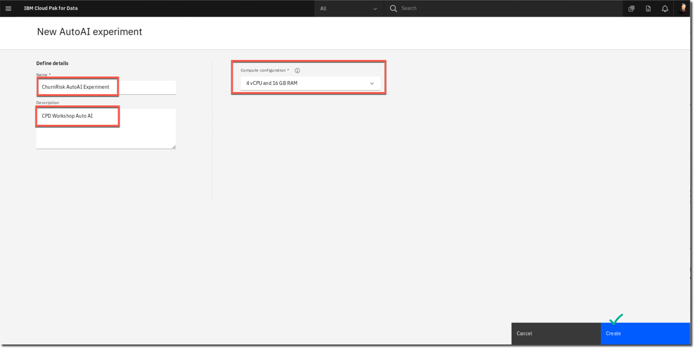
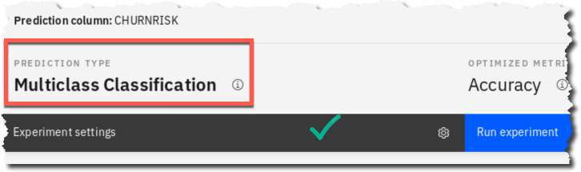
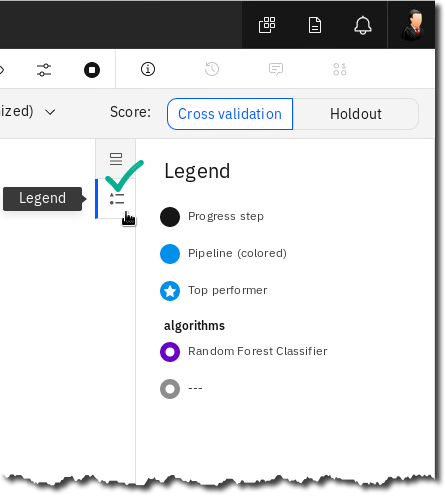
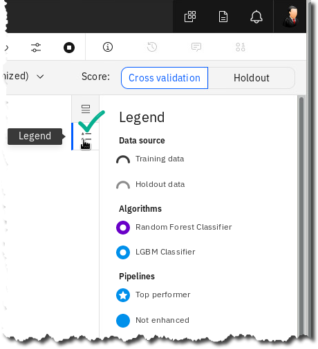
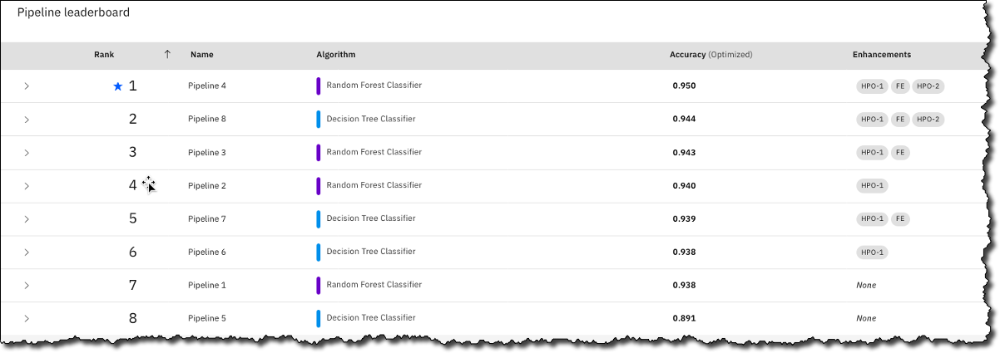
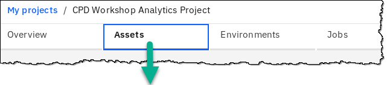
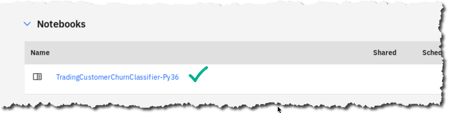
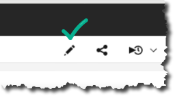
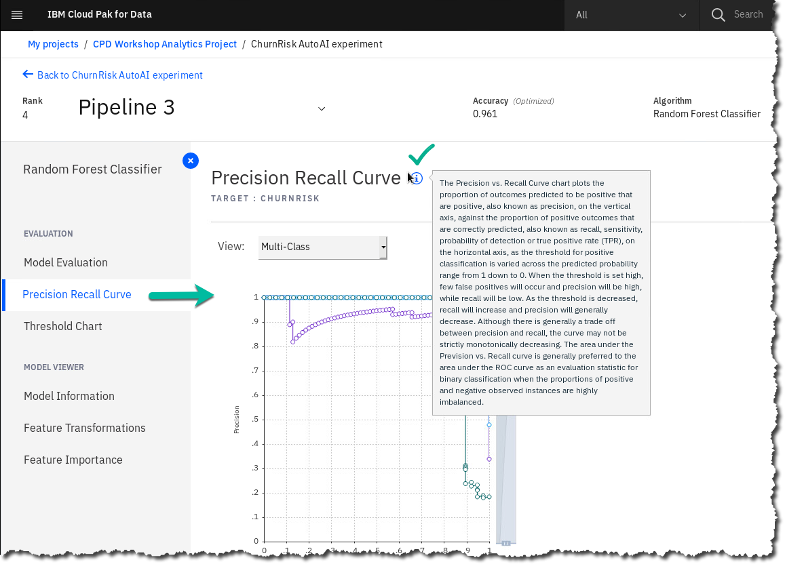
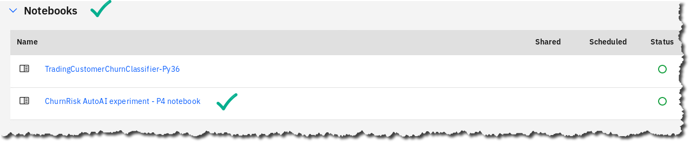

# Analyze: AutoAI

## Lab overview

Analyze is the third phase in the Cloud Pak for Data platform and workflow. This is where data scientists and business analysts can join forces to gain insights from their organization's data. Analyze capabilities can be delivered with a number of different CPD services. Examples:
 - AutoAI (included with the Watson Machine Learning service)
 - Notebook model creation (included with the Watson Studio service)
 - SPSS Modeler
 - Decision Optimization
 - Cognos Analytics (or Cognos Analytics Embedded)
 - IBM Streams (which could be "Collect" or "Analyze" depending on how it is used)
 -   RStudio model creation\...and others

In this lab you will explore AutoAI, which helps simplify the Machine Learning model AI lifecycle by automating the following:
 - Data preparation
 - Model development
 - Feature engineering
 - Hyper-parameter optimization
  > 

## Persona represented in this lab

The Data Scientist persona is the most likely role to perform the Analyze tasks in this lab, that is, to create a machine learning model with AutoAI that can be deployed and infused into an AI application.

|:---:|:---|
| **Persona (Role)** | **Capabilities**|
|:---:|:---|
|  | Data Scientists bring expertise in statistics and the process of building ML-AI models to make predictions and answer key business questions. |

## Logging into the CPD web client (if you have not already done so)

1.  If you are starting this lab stand-alone (without going through previous labs) do the following:
1.  Click the desktop icon: Cloud Pak for Data Web Client.

1.  The CPD web client GUI displays as shown. Use cpduser and cpdaccess for the *Username* and *Password* and click Sign in.

## Setting up the AutoAI experiment

In the lab, you will create an AutoAI experiment that will be used to automatically create the machine learning model that best fits the data to provide the desired outcome. One only needs to provide general guidance, and AutoAI will do the rest of the work.

In our scenario, Trade Co. data scientists accelerate their time to value using this powerful tool.
> 

1.  In the CPD web client, click the Navigation Menu ("hamburger" icon) a Projects.
  
1.  Select the project: ***CPD Workshop Analytics Project***.
  
1.  Once the project is opened, at the top right corner of the screen click on: Add to project +.
   
   1. In the next screen hover over and then click on the tile: *AutoAI experiment*.
      
   1.  In Name, enter *ChurnRisk AutoAI* experiment.
   1. Fill in anything you like in **Description**.
   1. Leave the defaults for **Compute** configuration.
   1. Click *Create*.
     
 **Note:** If you have to wait a long time for the spinning circle to complete, simply return to the CPD Workshop Analytics Project and select ChurnRisk AutoAI Experiment from the list of Assets.*
1. In the screen Add data source, click Select from project.
   
1. Select **File name**: ***customer_demochurn_activity_analyze.csv***.

**Click** ***Select asset***.
  

|:---:|:---|
| | The CSV file used in this AutoAI experiment is a join of Db2 CUSTOMER_CHURN, Db2 CUSTOMER_DEMOGRAPHICS and MongoDB CUSTOMER_ACTIVITY data.|
| Data Scientist | If you have been doing all the labs so far in this workshop, you would have completed the previous Data Flow Designer and Data Virtualization labs that transformed and joined these tables together as one virtualized view.  Since AutoAI requires a file as input, this virtualized view was exported to a CSV file (customer_demochurn_activity_analyze.csv) to be used as input for this lab.|
1. In the screen Select prediction column, select Column name: CHURNRISK.
   
1. Notice that the bottom of this screen now fills in when CHURNRISK is select as the Prediction column.
  - AutoAI has determined for you a PREDICTION TYPE = Multiclass Classification.
  - Click Experiment settings.
   
1. The first Experiment setting you can change from the values chosen for you is Data source
This allows you to change the Holdout data split (for testing vs. training)
  
If you scroll down you can see that you can optionally choose to select which columns to include in the experiment as well.
Leave these settings as-is and click on the section: Prediction.
1. The second setting you can change is Prediction.
The first section in the Prediction settings is the Prediction type.

Read what all three Prediction types are best suited for. The one chosen for you was derived from the column CHURNRISK, which, by the way, has three values - High, Medium and Low. Thus, AutoAI determined that Multiclass classification is best suited for this data.

Leave these setting as-is.
  

1. Scroll down to review the next section: Optimized metric. Notice that AutoAI chose Accuracy for you. Hover over a few of the other metrics you could choose if you so desired.

A Data Scientist would best determine if and when to deviate from this recommended metric, but you will leave this choice as-is.

16. Scroll to review third section which allows you to choose which algorithms to test. Remove the LGBM Classifier from the list by deselecting it.

17. Click the Runtime setting to review the last settings for your experiment.

18. Click Save settings to save your changes.

## Running the AutoAI experiment

19. At the bottom of the screen, click Run experiment.

20. You will first see AutoAI go into a Preparing mode... then it will be Pending.

21. Once it is running, you can click on \[Swap view\] to see each of the two different infographics: Relationship map and Progress map.

22. Review the Legend for each infographic map.

 

23. On either infographics map, you can scroll down to see the Pipeline leaderboard.

AutoAI begins building several different pipelines (possible solutions for the best model) ranking them as it goes along. You will see the pipelines complete and rank as the process continues.

24. As AutoAI does its work, watch it flow through its various steps:

|:---:|:---|
| -   **Read dataset:** Reads the data set you provided for the experiment.|
| |
| -   **Split holdout data:** Splits the data between testing and training. |
| | -   **Read training data:** Reads training data to prepare for preprocessing. |
|  |
| -   **Preprocessing:** Most data sets contain different data formats and missing values, but standard ML algorithms work with numbers and no missing values. AutoAI applies various algorithms (estimators) to analyze, clean, and prepare your raw data for machine learning. It automatically detects and categorizes features based on data type, such as categorical or numerical. It determines the best combination of strategies for missing value imputation, feature encoding, and feature scaling for your data. |
|  | | -   **Model selection:** AutoAI uses a novel approach that enables testing and ranking candidate algorithms against small subsets of the data, gradually increasing the size of the subset for the most promising algorithms to arrive at the best match by ranking large numbers of candidate algorithms. This approach saves time without sacrificing performance.|
|  |
| -   **Selected estimator:** Shows the estimator chosen from the model selection step.|
|  | | -   **Hyperparameter optimization:** Refines the best performing model pipelines by using a novel hyper-parameter optimization algorithm optimized for costly function evaluations such as model training and scoring that are typical in machine learning. This approach enables fast convergence to a good solution despite long evaluation times of each iteration. |
||
| -   **Feature engineering:** Attempts to transform the raw data into the combination of features that best represents the problem to achieve the most accurate prediction. AutoAI uses a novel approach that explores various feature construction choices in a structured, non-exhaustive manner, while progressively maximizing model accuracy using reinforcement learning. This results in an optimized sequence of  transformations for the data that best match the algorithms of the model selection step.          |

## Running a Notebook

While the AutoAI experiment is running, **open another** CPD web client to perform a parallel exercise.

25. Minimize the CPD web client browser to be able to get to the desktop.

26. Double click the desktop icon: Cloud Pak for Data Web Client.

27. This will open a second CPD Web client browser tab.

The AutoAI session is running in the first tab **[so don't close it!]{.ul}**

28. In the CPD web client, click the Navigation Menu a Projects.

29. Select the project: CPD Workshop Analytics Project.

30. In the section Assets, scroll down to find Notebooks.

Click TradingCustomerChurnClassifier-Py36.

31. You will be presented with the opened notebook.

32. Click the Edit (pencil) icon to put the Notebook in edit mode.

(Note: If you are returning to the Notebook, it may already be in edit mode.)

|:---:|:---|
|  | Note: if you received an error like this "403: forbidden."                                                                                                                                                                       |
|                                                                                                                 |                                                                                                                                                                                                                                  |
| Data                                                                                                            |                                    |
|                                                                                                                 |                                                                                                                                                                                                                                  |
| Scientist                                                                                                       | Fix the problem by leaving this screen and going to My Instances a Environments and then delete the Runtime environment for Python 3.6 that is currently running. Try opening the notebook again after returning to the project. |
|                                                                                                                 |                                                                                                                                                                                                                                  |
|                                                                                                                 |                                                                                 |

33. The Notebook will start a runtime and present a screen with the top left looking like this:

34. Click on the Fast Forward (double arrow) icon to re-run the whole notebook.

35. Click Restart and Run All Cells.

36. The notebook will now start running each cell in sequential order. A number will be placed next to each cell after it has executed.

Scroll up to the first cells under 1. Load libraries.

|:---:|:---|
|  | **Note:** You can run the notebook cell by cell or all at once. Either way will give you the same result. Any cell that has not yet run is indicated like this: \[\*\] |

37. Scroll to the 4^th^ cell (under 2. Load data example) to see the input file for this notebook. Notice it is the same input file from the same project that AutoAI is using.

Scroll through this section of the notebook to see various visualizations of the data.

38. Review the cells in 3. Data preparation.

39. The next section is self-explanatory: 4. Build Random Forest classification model.

40. Scroll to find Model Results, then find the Accuracy.

41. Cell \[30\] shows the "Feature Importances," that is, the data columns that affected the model the most

42. Finally, review the name listed in 5. Save the model into WML Deployment Space.

We will be referring to this Deployment Space in a later lab.

43. Also note at the very end of the notebook in the last two cells that two files are created for batch scoring and evaluation.

Your notebook has NOT finished until you see that the last two code cells (above) have a number from the run.

44. One key data point to take particular note of from this notebook run is found in cell 25, which is the accuracy of the Random Forest model created by this notebook.

|:---:|:---|
|  | **Ten Reasons Why I Like my Jupyter Notebook**|
|  | 1.  **All in one place**: The Jupyter Notebook is a web-based interactive environment that combines code, rich text, images, videos, animations, mathematical equations, plots, maps, interactive figures and widgets, and graphical user interfaces, into a single document.|
|  | 2.  **Easy to share**: Notebooks are saved as structured text files (JSON format), which makes them easily shareable.|
|  | 3.  **Easy to convert**: Jupyter comes with a special tool, nbconvert, which converts notebooks to other formats such as HTML and PDF.|
|  | 4.  **Language independent**: The architecture of Jupyter is language independent. The decoupling between the client and kernel makes it possible to write kernels in any language.|
|  | 5.  **Easy to create kernel wrappers**: Jupyter brings a lightweight interface for kernel languages that can be wrapped in Python. Wrapper kernels can implement optional methods, notably for code completion and code inspection.|
|  | 6.  **Easy to customize**: Jupyter's interface can be used to create an entirely customized experience in the Jupyter Notebook (or another client application such as the console).|
|  | 7.  **Extensions with custom magic commands**: Create IPython extensions with custom magic commands to make interactive computing even easier. Many third-party extensions and magic commands exist, for example, the %%cython magic that allows one to write Cython code directly in a notebook.|
|  | 8.  **Stress-free Reproducible experiments**: Jupyter notebooks can help you conduct efficient and reproducible interactive computing experiments with ease. It lets you keep a detailed record of your work. Also, the ease of use of the Jupyter Notebook means that you don't have to worry about reproducibility; just do all of your interactive work in notebooks, put them under version control, and commit regularly. Don't forget to refactor your code into independent reusable components.|
|  | 9.  **Effective teaching-cum-learning tool**: The Jupyter Notebook is not only a tool for scientific research and data analysis but also a great tool for teaching.|
|  | 10. **Interactive code and data exploration:** The ipywidgets package provides many common user interface controls for exploring code and data interactively.  |

## Reviewing the AutoAI results

45. Return to your first CPD Web client browser tab.

If the AutoAI experiment has not completed yet, let it finish. You can tell if it is finished by looking at the Relationship map view.

|:---:|:---|
|   | Note: this experiment may take 25 minutes or more to complete, but this is not normal. We have turned off AVX/AVX2 processor support for this workshop so that the Cloud Pak for Data workshop image can run on servers that do not have AVX nor AVX2 processors. If we did not do that and the workshop was run on servers without AVX/AVX2 processors, the experiment would fail. So, we took this route to make sure the AutoAI experiment would run under any circumstances on any server, with or without AVX/AVX2 processors. |
| | **That said, with a CPD cluster on AVX/AVX2 supported processors this experiment completes on average, in around 3 minutes.**|
| | Servers with AVX/AVX2 processors were released in 2011 and are mostly ubiquitous. Your organization probably has them.|
|   | Note: the results from your AutoAI experiment may vary from the illustrations in this workbook. This is especially true for Feature Transformations. |

46. AutoAI chooses the best model from the various pipeline leaderboard options as Rank \#1. You can scroll down in either map infographic screen to see the leaderboard.

Notice the Algorithm chose (Random Forest classifier) and the most accurate result.

Click on the \#1 ranked Pipeline 4. 

47. Model Evaluation shows the various evaluation accuracy figures. Click through them but make sure to return to the original view - Multi-Class.

48. Precision Recall Curve Shows the tradeoff between precision and recall.

49. Threshold Chart helps choose a threshold for best performance based on the chosen measure of performance.

50. Model Information gives info on type of model fitted.

51. Feature Transformations displays new features created by AutoAI. This is a powerful capability of AutoAI because this is not something a Data Scientist may intuitively do themselves in a notebook. (Note: your results may vary from this screen shot.)

52. Feature Importance displays the relative importance of the feature in predicting the target.

## Saving the model

AutoAI gives you two options to save the model you decide is the best one for your application. You can either save the model as a model or save the model as a Notebook.

### **Saving the model as a model**

53. Hover your mouse over the right side of your Top Rank model, click Save as a Model.

    

54. In the screen *Save as model*:

Model name: keep it as is

Description: CPD Workshop AutoAI experiment

Click Save.

55. Exit the confirmation pop up by clicking x.

### **Saving the model as a notebook**

56. On the top right corner of the screen, click Save as a Notebook.

57. In the screen *New notebook*:

Name: keep it as is

Description: CPD Workshop AutoAI -- Notebook creation

Click Create notebook.

58. You will be taken to the new notebook in edit mode in the project.\
    \
    Take a moment to examine the new auto-generated notebook you just created.\
    \
    Exit the notebook by clicking CPD Workshop Analytics Project on the breadcrumb trail.

### **Reviewing the project**

59. You should be back in the project and under the Assets tab. (If you are not, navigate there now.)

Scroll down to find the Notebooks section. There you will find the AutoAI generated notebook you were just in.

60. Scroll down farther to find the model you created from the AutoAI save feature. Select the ChurnRisk AutoAI experiment -- P4 RandomForestClassifierEstimator.

61. Review your new AutoAI generated model.

62. Close any extra browser tabs you may have open, leaving only one.

## Lab conclusion

The AutoAI generated model had greater accuracy than the one built by the notebook. AutoAI can test many variations of a model in minutes that a Data Scientist would take days, weeks or even months to try out manually using a notebook approach. And AutoAI does not require any coding at all, making it an available solution to more people.

Data Scientists will always love their notebooks for the reasons listed in this lab, but AutoAI is an industry unique IBM differentiator that will enable the Data Scientist to be more productive. A data scientist can accelerate model creation using AutoAI and then tweak it using a Jupyter notebook if desired. In minutes AutoAI generates this code that would normally take hours or days to create manually.

To fulfill the promise of AI, organizations are tackling skill-set gaps, deployment, and governance processes today. In particular, businesses are seeking an alternative where citizen data scientists can quickly get started, while expert data scientists can speed experimentation time from weeks and months to minutes and hours. 

Both groups need a multimodal data science and AI environment where data and analytics specialists collaborate with other experts and optimize model performance end-to-end.

AutoAI in the Cloud Pak for Data Watson Machine Learning service solves this requirement.

Read here how AutoAI won the 2019 Alconics award for *"Best Innovation in Intelligent Automation"*: <http://ibm.biz/The-Alconics-Awards>

**Award for IBM's AutoAI**

**\*\* End of Lab 06 - Analyze: AutoAI**
