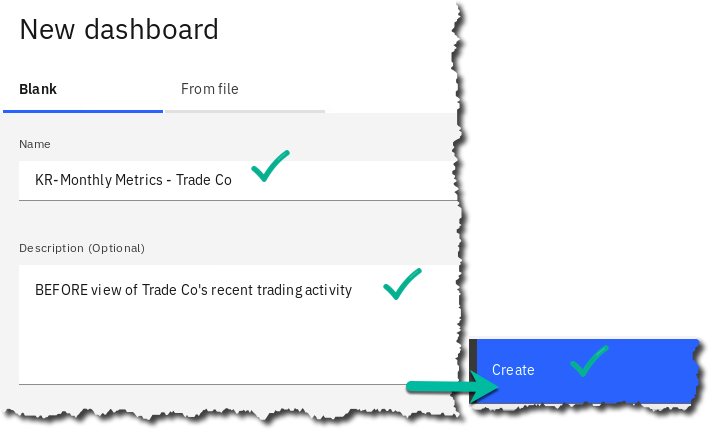

# Cognos Dashboard Embedded - Deeper Dive

## Lab overview

When embarking on machine learning projects, many organizations engage Business Analysts to help gain insight into their data. This persona can use tools like Analytics Dashboards (part of the CPD offering) or the more capable cartridge from which this service is derived: Cognos Analytics.

In this lab, you will use the Analytics Dashboards to build visualizations to help the organization understand why their customer use is declining.

In our scenario, the Trade Co. Business Analyst used this service to provide the company executives and the data scientists the information they needed to understand their problem as well as to access the effectiveness of the solution.

## Persona represented in this lab

The Business Analyst persona is likely to perform the exercises in this lab, and that is to create visualizations to make sense of the problems the organization is facing.

 | **Persona (Role)** | **Capabilities** |
 | :-: | :-- |
 |  Business Analyst | Business Analysts deliver value by taking data, using it to answer questions, and communicating the results to help make better business decisions. |

## Logging into the CPD web client (if you have not already done so)

1.  If you are starting this lab stand-alone (without going through previous labs) do the following:
1.  Click the desktop icon: Cloud Pak for Data Web Client. 
1.  The CPD web client GUI displays as shown. Use cpduser and cpduser for the *Username* and *Password* and click Sign In. 

## Reviewing the dashboard: Monthly Metrics - Trade Co.

In the dashboard Monthly Metrics -- Trade Co., the business analyst for Trading Co. has painted a picture of how the business was initially doing. The dashboard shows a relatively flat shares sold per month, and a declining number of traders per month, which the business analyst provides to the Trade Co. executives. 

## Building the dashboard: Monthly Metrics - Trade Co.

The business analyst began by analyzing current trends of customer visits and daily trades in the Trade Co. Stock Trader application. He requested the data engineers to provide a file with historical totals of visits and trades for the past year [TraderData.csv](TraderData.csv) which was deposited into the project where everyone on the team could collaborate.

Build the dashboard with that data to see the trends the business analyst discovered.

### Starting the dashboard

1.  From the top left Navigation Menu Projects CPD Workshop Analytics Project.
1.  Under Assets click Data Assets. Notice TraderData.csv available in our project. 
1.  Click Add to project + Dashboard. 
1.  In the Blank tab, fill in the Name and Description as shown below, then click Create\
    - for the name*,* use initials-Monthly Metrics -- Trade Co. 
1.  You are now presented with a choice of canvas templates. Select the one that looks as shown Click OK. 
1.  From the Selected sources area near the top left of your screen, click .  
1.  Expand arrow next to Data assets and choose: TraderData.csv Select. 
1.  Click on TraderData.csv once it is in the Selected sources. This will allow you to expand it. 
1.  Now expand TraderData.csv. 
1. Next. ensure the properties of the column data are what you want to be represented correctly within the dashboard. Click the MonthNum ellipsis, then select Properties from the flyout menu. 
1. MonthNum is an attribute on which we sort our months. Change MonthNum usage to be Attribute and Aggregate to be None, Represents Default, then click Close. 
1. Select the Properties of Month by selecting the ellipses next to Month. 
1. Change Aggregate to None. Change Members to Enabled. Select Sort by -- MonthNum. Click Close. 
1. Next, set the aggregation of our measures for totaling. Hold the shift key down and click SharesSold and DailyTraders to select both. Click the ellipsis and then click Properties. 
1. Make sure *Aggregate* is Total in the drop-down menu. Click Close. 

### Building the first visualizations

1. Drag SharesSold to the top left box, hovering over the *Drop here to maximize* area when it turns blue, then releasing the mouse. This gives us a total of Shares sold over all time. 
1. If you did not drop at the right place it won't fill the template area. You can still adjust the guide to match with the outline of the left box. It should look as below. 
1. Drag DailyTraders to the top right box, hovering over the *Drop here to maximize* area when it turns blue as well. This maximizes this metric in this box. This gives us a total of trades over all time. 
1. After you complete both top boxes, the dashboard should display as shown: 

### Building the line charts

1. Hold the \[Ctrl\] key down *(or Control-Option on Mac),* click Month and SharesSold and drag the two onto the lower left canvas area. This time [do not]{.ul} drop in the *Drop here to maximize* area.
1. When finished, it will automatically format like this. (Stretch the visualization wider if needed.) 
1. Cognos Analytics uses augmented intelligence to automatically provide you with a chart and appearance that would most likely be represented by the data you select from your data source. You are not limited by this and can select other charts and graphs to represent your data. To see all the available visualizations available at your fingertips, simply select the chart selector (Line, in this case), and view all the visualizations available. 
1. Click the X to close the Change visualization screen. 
1. Hold Control key down, click Month and DailyTraders and drag the two onto the lower canvas area. Again, [do not]{.ul} drop in the *Drop here to maximize* area. 
1. Adjust the top, bottom, left and right of the chart boundaries so that all the boxes are aligned.
1. The dashboard should display as below. 
1. Click the Save icon at the top of the screen to save your work. 

### Making the finishing touches

1. Select (by clicking on) the bottom left chart visualization, then select the Properties button at the top of the screen to format that visualization. 
1. Expand Appearance, then from the General tab, check Show title. 
1. In the bottom left visualization itself you can now type in a title for it. nter Shares sold per month. 
1. Click the bottom right visualization, select Properties *(if not selected)*, Appearance, General tab, Show title, and enter Number of Traders per month. 
1. From the Visualization tab, expand Chart, then check Show Value Labels. 
1. Select the Shares sold per Month chart then check Show Value Labels.
1. On the left side of the canvas, click the Widgets menu and drag a Text box between the top two visualizations. Title it Stock Trades. Adjust the box so the title is large and readable. 
1. Format the properties of the title Stock Trades. Make the text font size 48, bold, choose light teal text color and center aligned. 
1. Close the Widgets panel. 
1. Next, let's change the overall look of the dashboard to match our desired look and feel. Select somewhere outside the boxes to select the overall dashboard itself. For example, click to the left of the top left visualization as shown: 
1. This selects the entire dashboard. Select Properties again, expand Color and theme and choose Dark.
1. Close Properties by selecting Properties.
1. Select tab at top left and choose the Pencil icon to Edit the title. Give it a title of Stock Trades. 
1. The final results should look something like this: 
1. Click Save again to mark your progress.

You will notice from examining the charts that Shares sold is relatively flat and daily trades are falling off. We need to use CPD to discover the WHY behind this trend.

## Lab conclusion

Dashboard creation and analysis is just one part of the Analyze phase, but a business analyst can do this relatively quickly and simply so that they can get information from your organization's data without relying on data scientists for everything.

However, the Data Scientist can take this information and create machine learning models from the knowledge gained by this kind of analysis.

 End of Lab 14 - Cognos Dashboard Embedded -- Deeper Dive
