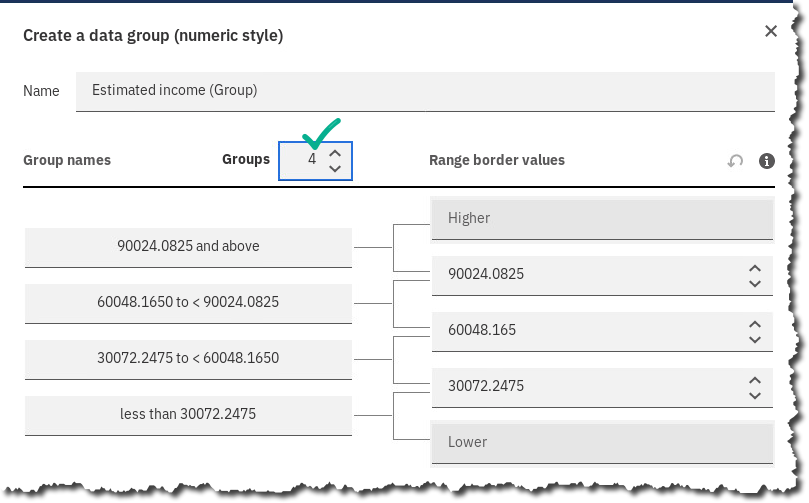
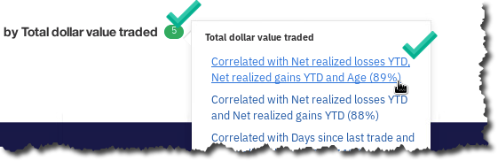

# Infuse: Cognos Analytics - Introduction

## Lab overview

In this lab, we will upload a CSV file given to us by our IT department to see if there is any interesting information and if we can use this information to better target market our potential high-risk churn customers.

For this lab, we will use the power of the IBM Cloud Pak for Data platform and the IBM Cognos Analytics cartridge. Installation of the IBM Cognos Analytics cartridge has already been done for you.

## Persona represented in this lab

For this lab, we will assume the roles of both a Data Engineer and a Business Analyst.

 | **Persona (Role)** | **Capabilities**  |
 | :-: | :-- |
 |  Business Analyst | Business Analysts deliver value by taking data, using it to answer questions, and communicating the results to help make better business decisions. |

## Logging into the CPD web client (if you have not already done so)

1. If you are starting this lab stand-alone (without going through previous labs) do the following:
1. Double-click the desktop icon: Cloud Pak for Data Web Client. 
1. The CPD web client GUI displays as shown. Use cpduser and cpdaccess for the *Username* and *Password* and click Sign In. 

## Logging into the IBM Cognos provisioned instance

1. Select the Navigation Menu icon at the top of the screen. 
1. Select My Instances from the menu.
1.  Select Provisioned instances from the tab at the top.  Here you will see a list of instances that have been provisioned for you already.
1.  Select the ellipses at the end of the cognos-analytics-app and select Open.  You will now be automatically directed and logged into the IBM Cognos Analytics instance on your IBM Cloud Pak for Data platform.

## The IBM Cognos Analytics User Interface

**The purpose of the User Interface (UI) is to provide Users with a streamlined way to get started using Cognos Analytics and view content and activities pertinent to them.**

The User Experience brings you directly into the completely redesigned IBM Cognos Analytics User Interface (UI).

All IBM Cognos Analytics Users begin their navigation here at the Welcome Screen. 

 | **Persona (Role)** | **Capabilities**  |
 | :-: | :-- |
 |  Business Analyst | TECH TIP: Not all Welcome Screen Getting Started tiles may be available in your workshop instance. The Welcome screen getting started tiles presented are based on which have been configured to run in the environment[.] |

1. Click on the Welcome Screen toggle button on the upper left of the canvas to collapse the Welcome Screen's Getting Started content. 
1.  The canvas now shows the Recently used files, if any, in the **Recent** section, along with **the File drop zone** where users can easily upload their data files. 
1. Once you begin working with content, the canvas will update with your recently used items.  In your Cognos Analytics instance, you may see recent content on the canvas.  Now that we are in the IBM Cognos Analytics user interface, let's make a connection to the IBM Cloud Pak for Data -- Virtualized Data. Remember, our business use case here is to analyze and create a dashboard quickly from this new set of data we virtualized. We did not have to wait for a Data Warehouse or Data Lake to be completed. Let's do some analytics at the speed of thought!

## Importing the CSV file as an Exploration

1. From your Cognos Analytics Home screen, select New -- Upload. 
1. Download and Select [CustomerChurnDemographics-CA_Lab.csv](CustomerChurnDemographics-CA_Lab.csv). If you are accessing via browser, you may download the file from <http://ibm.biz/Churn-Demographics>. 
1. Cognos Analytics will then begin to import and analyze the data in the CSV file. 
1. In the Recent area, in the upper left corner of the CustomerChurn CSV card, select ellipses Create exploration. 

## Cleaning up the data

When IBM Cognos Analytics imports CSV files, it does its best to understand the data type, usage and aggregation from reading your data. Depending upon the data you import, you may need to help IBM Cognos Analytics out by defining some data properties.

1. From the left-hand menu, select the icon for the Data tab.  **Note:** You will notice icons next to each field showing a representation of the data items usage as recognized by IBM Cognos Analytics. Measures are represented by a ruler, numeric values as a hash, text values as ABC, time values as a clock and geographic points as a pin.
1. Because this data is a snapshot total of values for a given date, you will need to change the aggregation properties of your measures, so they roll up correctly and do not give you misleading or false information.

    | **Persona (Role)** | **Capabilities**  |
    | :-: | :-- |
    |  Business Analyst | **TIP:** If you cannot read the full name of the data item shown on your screen, simply hover over the name and a fly out will display the full name. Another option is to use the zoom out feature of your browser. |

1. For the following measures, change the Properties of the Data Item by selecting the ellipses at the end of each item and choosing Properties from the menu. For example, the following displays the properties for Average Dollar per Unit traded: 
1. You will be presented with the Properties of that measure. Change the Aggregate of Average Dollar per Unit traded measure to None, then Close. 
1. Change the other Data Items with the following property values by following the previous steps.

    | **Data Item** | **Usage** | **Aggregate**|
    | :-- | :-: | :-: |
    | Average Dollar per Unit traded |  Measure  |   None |
    | Net realized gains YTD  | Measure | None |
    | Net realized losses YTD  | Measure | None |
    | Days since last login | Attribute |  Count Distinct |
    | Days since last trade | Attribute  | Count Distinct |
    | Age | Attribute  | Count Distinct |
    | Children  | Attribute  | Count Distinct |
    | Estimated Income | Attribute |  None |

1. Because there are a lot of Estimated Income values, it would be better to group this data in buckets for easier understanding. By Estimated income, select ellipses Create data group. 
1. Choose Create a data group (numeric style). 
1. You will be presented with the following auto grouping: 
1. Change the number of Groups to 4.  **Note:** You could manually enter group values or use Cognos to automatically do it for you!
1. Select Create. You will notice you have created a new grouping at the top of your Data Items list. 
1. When you are finished, return to the Exploration canvas by selecting the Exploration tab.   IBM Cognos Analytics Exploration asks you: Where do you want to start?  You can see that IBM Cognos Analytics suggests starting with some of the measures it found in your Data Module. This is helpful in discovering what are the possible drivers behind each of your metrics. IBM Cognos Analytics uses a powerful AI engine to assist you in discovering possible drivers between measures and dimensions, strength of relationships between dimensions, and also possible ways of examining this data for you by suggesting highly visual graphs of this data by dimension.  When IBM Cognos Analytics suggests: Try starting with one of these... it is providing you an easy way to begin discovering and exploring what it finds as potentially important (what is driving our metrics?) based on a measure or dimension.  We are not limited to these options, though.
1. Select the area where it asks you to Enter data column and you will see that all of your Data Module Data Items are presented. 

    | **Persona (Role)** | **Capabilities**  |
    | :-: | :-- |
    |  Business Analyst | **TIP:** If you're really adventurous, or do not know the data you are exploring very well, you could select the Skip -- show me anything link and IBM Cognos Analytics will select any measure as a starting point. Do not do this for this Workshop It's good to know you can use the AI help from IBM Cognos Analytics when you need. |

## Exploring Data Relationships

For this workshop, let's have IBM Cognos Analytics help us understand our customers better from this data set.

Let's first find out which customers are spending the most on trades with us.

1. From the dropdown, type Churn, then select Churn Risk. 
1. By hovering over each of my measures associated with Churn Risk, I can get a quick understanding of relationship strength that is driving Churn Risk.   For example, there seems to be a 73% relationship strength between Net realized losses YTD and Churn Risk.
1. Hover over other measures to see how they relate as well.  You can see that IBM Cognos Analytics has selected the scope of fields to show relationship strength between. You are not limited to this, however. You can change the scope of this relationship examination to remove fields that you know may interfere with getting a proper result.
1. Select the drop-down menu to Edit diagram and select Edit scope.  Fields such as DOB, Longitude and Latitude are probably Data Items that do not bring any value when examining your data relationships and [may cause static]{.ul} when exploring your data.
1. You can remove those by hovering over, then selecting the  next to DOB, Longitude and Latitude, then OK.  IBM Cognos Analytics gives you the flexibility to remove fields that you may not require when exploring your data and may interfere (static) with your analysis.
1. You can also investigate secondary relationships to see the strength of the relationship between all fields. Select Edit diagram Secondary relationships. 
1. Hover around each of the fields to see view the relationship strength IBM Cognos Analytics discovered between them. 

## Creating Exploration Cards

When IBM Cognos Analytics examines relationships, the powerful AI engine will begin to surface charts and graphs that may be of interest to you. This is especially helpful if you are unfamiliar with the data you are working with.

Scroll down on the far-right portion of your screen, then notice that IBM Cognos Analytics has presented you with three visualizations. You can begin with one of these info graphs or 'Cards' or see more Cards.

1. Select link See more. 
1. You are now able to see more auto-generated cards via the power of IBM Cognos Analytics AI. IBM Cognos Analytics is using its powerful AI engine to discover new possible drivers or interesting information from your data source.
1. Select inside the card: Total dollar value traded by Churn Risk and Status. 
1. Notice that it has added the Card to the left side in the Exploration Cards area. 
1. We can see that our High and Medium Churn Risk customers are mostly married. You can view more interesting discoveries by viewing the Details tab.  Let's now see if Gender plays a role in how much money they trade with us.
1. Select the Data slots tab at the top next to Details. 
1. Cognos Analytics provides you interesting insight to your data automatically, but you can take control, too. Select the data tab on the far-right side. 
1. From here, drag Gender over to on top of Status. 
1. This chart is showing that our high-risk customers who trade the most dollars with us are Female and Married. Cognos Analytics also provides hints at other data points which seem to be related. Cognos Analytics found 5 other points of interest for you. Select the 5 at the top and choose Correlated with Net realized losses YTD, Net realized gains YTD and Age (89%). 
1. Next to the title for the fly out, select the 5 Correlated with Net realized losses YTD, Net realized gains YTD and Age (89%). 
1. Choose the Explorations tab on the left  and you will now see the following:  
1. Notice the strength of the predictor is higher when a combination of drivers is applied.
1. Examine the Decision Tree at the bottom provided by IBM Cognos Analytics.
1. At the bottom right, select Add button (to add this Decision Tree as a new Exploration card). 
1. Select the Decision Tree card at the left. 
1. Now you are easily seeing combinations of drivers and their relationship strength in terms of Total dollar value traded. Select the Top 5 Nodes to show your top 5 nodes in the tree. 
1. But you are not limited there. You can view other ways of looking at this data. Choose Tree sunburst from the top tab. 
1. You will now be presented with the Sunburst diagram. 
1. So far, IBM Cognos Analytics has been guiding us and creating charts based upon a metric we were looking for. We also have the ability to create exploration cards on our own.
1. From the top menu, select New card Single -- Choose a Type. 
1. Choose Map under the group Geospatial. 
1. Select the Data Tab, then under Data slots, expand Regions.  Drag Total dollar value traded to Location color. Drag State to Locations. 
1. Select the Details tab to get more information on this map. It looks like most of our big spenders are in Texas and New York. Zoom in on the U.S. and center it to focus.
1. Let's create one more Exploration card. From the top tab, select New card Single Choose a type.  
1. This time let's choose a heat map from the Relationships group. 
1. Drag Estimated income (Group) to Rows. Drag Total dollar value traded to Columns. Drag Total units traded to Heat. 
1. That looks really noisy! Let's now group that Total dollar value traded. Lucky for us, IBM Cognos Analytics allows you to Auto-group on the fly. Select the ellipses next to Total dollar traded Auto-group. 
1. Turn on Auto-group and set Number of groups to 5. 
1. That's easier to read! Visualizing that sweet spot is now so much easier.
1. Now we will have IBM Cognos Analytics Assistant create a Dashboard for us. Select the Assistant link on the left, then choose the suggestion of create dashboard. 
1. You should now see the following:  IBM Cognos Analytics Assistant created a dashboard for you!
1. You can investigate this dashboard by selecting the tabs at the top or hover over any of the charts and graphs. We wish to focus in on our high churn customers. So, let's filter this dashboard. From the Data tab , drag Churn Risk to the Filter All tabs location OK. 
1. Close the Data items tab by selecting it again and you should see all of your charts and tabs filtered on just your high churn risk customers. Building dashboards is easy in Cognos Analytics! 
1. Save your Auto-created Dashboard in your Personal Folder as Your name -- Dashboard from Exploration Lab. 

## Embedding Cognos Content

1. Now that you have created and saved your dashboard, you can Share your information to others. There are two options when sharing a link. You can either provide an HTML link to your dashboard or you can view the embedded code. You can also export your dashboard to a PDF file. To view all these options, choose the Share button at the top left. 
1. You will then see the Link options in the flyout. 
1. Use this information to embed and link your Cognos Analytics dashboard.

## Lab conclusion

The results of this Exploration and Dashboard give us a good understanding of our high churn risk customers, how much they spend and where they are located. I can make marketing decisions in these areas to ensure my business is not at risk of losing these customers.

You have now witnessed the ease at which IBM Cognos Analytics can create highly visual dashboards for greater business insight...all without need to code any expressions in a secure, governed manner.

You're off to a good start. Keep in mind, IBM Cognos Analytics offers insight and infused AI using several governed, easy to use components. Through this lab, you have experienced working with Data Modules, Explorations and Dashboards. But IBM Cognos Analytics offers other areas of insight as well, such as Reports and other areas of analysis that could not fit in this lab.

We encourage you to delve deeper into all these other avenues of insight by taking on other online IBM Cognos Analytics workshops available to you.

**TIP:** For a more detailed workshop on IBM Cognos Analytics Dashboards, please see: <http://ibm.biz/Cognos-Dashboards>
**TIP:** For a more detailed workshop on IBM Cognos Analytics Reporting, please see: <http://ibm.biz/Cognos-Reporting>

**\*\* End of Lab 09 -- Infuse: Cognos Analytics - Introduction**

Lab by Kent Rubin, IBM
