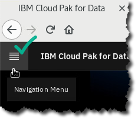
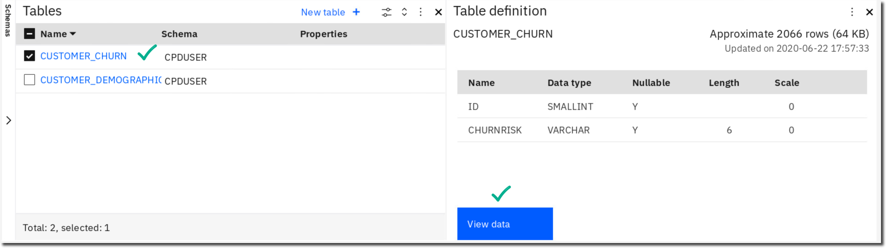

# Collect: Connections

## Lab overview

The Collect capability of CPD means accessing your organization's data regardless of where it resides, whether that be an in-cluster data source (e.g. the Db2 Advanced Edition) or a native connection to a remote data source. You can even use the Db2 Event Store or Streams services to provide streaming access that is best suited for Internet of Things (IoT) processing.

Additionally, Data Virtualization and Data Transformation are available to streamline the access, performance, and formatting of the data for use in later steps of the CPD analytics workflow.

In this lab you will explore Connections for the Collect process. In later labs you will explore Data Transformation and Data Virtualization.

> 

## Persona represented in this lab

The Data Engineer persona is the likely role to perform the various Collect tasks shown in this lab.

+---------------------------------------------------------------------------------------------------------------------------------------------------------------------------------------------+--------------------------------------------------------------------------------------------------------------------------------------------------------------------------------------------------------------------------------------------+
| **Persona**| **Capabilities**|
| :--: | :-- |
|  Data Engineer| Data Engineers build and optimize the systems to allow data scientists and business analysts to perform their work. The Data Engineer ensures that any data is properly received, transformed, stored, and made accessible to other users. |

## Db2 data overview -- Transforming for analytics

The Db2 data in our Trade Co. scenario (Demographics and Churn) have two key factors that make an appropriate scenario for Data Transformation:

-   The data only changes once a month (it is relatively static). Thus, copying it and/or changing it for downstream processing in our CPD analytics workflow is OK because we are not required to have the latest data to get the results we need.

-   The data must be changed before it can be processed in our CPD analytics workflow.

> 

Although you will be doing the actual Data Transformation in the next lab, you will prepare for it in this one by reviewing some steps in this Connections lab.

### Logging into the CPD web client (if you have not already done so)

1.  If you are starting this lab stand-alone (without going through previous labs) do the following:
1.  Double-click the desktop icon: Cloud Pak for Data Web Client. 
1.  The CPD web client GUI displays as shown.
  > Use cpduser and cpdaccess for the *Username* and *Password* and click Sign in. {width="1.57376968503937in" height="2.0689304461942255in"}

### Reviewing the Db2 Advanced Edition data

1.  To review this data, you will be launching the *Db2 Advanced Edition Data Management* *Console*.
  - In the CPD web client, click the Navigation Menu ("hamburger" icon). 
1.  Click Collect a My Data a Databases a Db2 Advanced Edition a ellipsis  a Open database *(Note: Please wait for the green check to appear next to Db2 Advanced Edition first.)*  
1.  At the top left of the Db2 Advanced Edition console, click on: Summary a Explore a Tables. 
1.  Select schema CPDUSER. 
1.  Click CUSTOMER_CHURN and click on it to bring up the table definitions view.
  - Click on View Data.  {width="2.7622944006999126in" height="1.170949256342957in"}  *This data represents churn risk that was determined through a manual methodology by Trade Co. It will be enhanced by a machine learning methodology created in this workshop.*
1.  Click on the Back icon, then table CUSTOMER_DEMOGRAPHICS a view Data.   {width="3.4016393263342084in" height="1.2323622047244094in"}  *This data represents the known characteristics of the Trade Co. customers themselves. The machine learning methodology of this workshop will take advantage of this data to determine churn risk more accurately.*

### Reviewing the Db2 connection

1. In order to create a connection to a CPD data source, you would first need the connection information. To review what that looks like for the in-cluster Db2 Advanced Edition, click:
  -Navigation Menu a Collect a My Data a Databases a Db2 Advanced Edition a ellipsis  a Details 
1. This takes you to the details page for this data source. On the right you will find the Access Information section which gives you the information you need to create a connection.   Note: Username and Password are explicitly shown (and easily copied using the icons) while the JDBC Connection URL string tells us the Host:Port/Database.
1. Now you can review the connection to the Db2 Advanced Edition that was already created for this workshop.
  - Go to: Navigation Menu a Connections a Db2 Advanced Edition  
1. Hover over the left part of the connection and click the Edit (pencil) icon. 
1. The Db2 Advanced Edition Connection edit screen looks like this:  Each data source type (Db2, Mongo, Hive, S3, Drop Box, and so on) has their own connection page format. Many of the relational database sources are similar to this one, while others require different credentials altogether.
1. At the bottom of the screen, click Test connection. 
1. At the top left of the screen, you should see this Success message. 
1. To exit the edit screen, click Cancel. DO NOT SAVE this connection.
  |  Data Engineer | **Note:** if you do NOT have a successful connection test as shown above, you should fix this by launching another CPD web client from the desktop and use the second web client to return to the Details screen of the Db2 Advanced Edition. Use both screens to make sure all the credentials match between the Details screen and the Connection screen, especially Username/Password. |

## MongoDB data overview -- Virtualizing for analytics

The Mongo data in our scenario (Activity) has two key factors that makes for an appropriate scenario for Data Virtualization:

  - The data is constantly changing (it is dynamic)

  - Our analytics processing requires the latest data   {width="3.416842738407699in" height="0.9931069553805775in"}

We have chosen semi-structured data in this scenario to demonstrate the power of CPD Data Virtualization -- it even works with JSON documents. But we could just have easily chosen a structured database source for it, like Db2, Informix, SQL Server, and so on.

Semi-structured (and even unstructured) data is commonly used in many systems of engagement applications (like Trade Co.'s Stock Trader) so this was another reason we chose this as an example data source type.

Our scenario presumes that this data comes from a mobile application that will be constantly changing the data, and that we would require the latest data for our analytics workflow.

### Reviewing the MongoDB data

The MongoDB database was provisioned after the MongoDB Enterprise service was installed, which is also located in My data.

1. Start at the Navigation Menu.
1. Click Collect a My data a Databases a MongoDB-1 a ellipsis  a Details.    
1. Examine the section MongoDB Ops Manager on the right.
  - Here you can review the username for the Ops Manager (which is cpduser).
  - Copy the Password using the icon. 
1. Now return to the My data screen and choose Databases a MongoDB-1 a ellipsis  a Open Database.    {

  |  Data Engineer | The very first time you log into this *MongoDB Ops Manager* console it may not ask you for user and password credentials. We have saved these for you in a browser setting.  However, if the credentials were not saved and should you encounter this Login screen (as above) you can use the password copied from the Details screen. Note: if the copy/paste of the password does not work for you using Details screen icon, then try this technique:  1.  In the Details screen, perform the "copy" by highlighting the password and right-click a copy.  2. In the Ops Manager login screen use right-click a paste.|
1. In the *MongoDB Ops Manager* console tab, click Deployment on the top left of the screen.
  - In the Processes tab, click on the Replica Set link, 
1. Click on the Data tab to review the JSON documents in database mongodb.activity01. 
1. When finished, close the tab Data \| MongoDB Ops Manager. 

### Reviewing the MongoDB connection

1. Go to Navigation Menu a Connections 
1. Click on connection MongoDB line and choose the Edit icon. 
1. Note that the credentials information is taken from the Details screen you reviewed earlier. 

## Lab conclusion

In this Collect: Connections lab, you reviewed connections for the Db2 Advanced Edition and MongoDB data. This prepares you for the Organize and Collect: Virtualize labs in this workshop.  

In the Organize lab coming up, we will be transforming the Db2 data sets into one.

After that, we will finish up the Collect processing by virtualizing the results from both the Db2 Transformation output and the MongoDB data together.

**\*\* End of Lab 03 - Collect: Connections**
