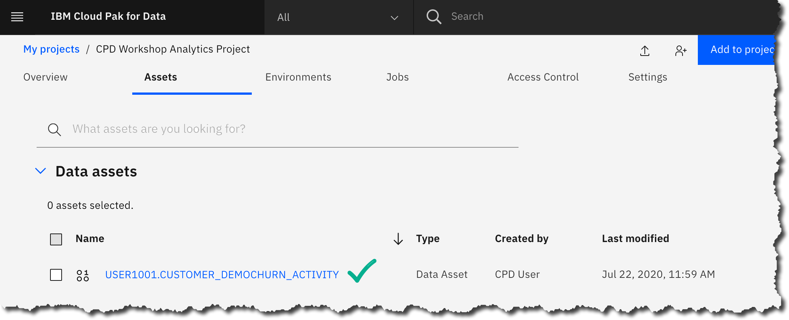

# Collect: Virtualize

## Lab overview

In this lab, you will learn about Data Virtualization to complete the Collect tasks by creating a virtualized view of the transformed Db2 Demographics and Churn data, joined with the MongoDB Activity data.

The team from Trade Co. wants to use data virtualization to easily join the disparate data sources into one view for easier consumption in their analytics work.

 
 

## Persona represented in this lab

The Data Engineer persona will be performing the various Collect tasks shown in this lab.

| **Persona (Role)**| **Capabilities**|
| :-: | :-- |
|   Data Engineer| Data Engineers build and optimize the systems to allow data scientists and business analysts to perform their work. The Data Engineer ensures that any data is properly received, transformed, stored, and made accessible to other users. |

## Logging into the CPD web client (if you have not already done so)

1. If you are starting this lab stand-alone (without going through previous labs) do the following:
1. Double-click the desktop icon: Cloud Pak for Data Web Client.
  
1. The CPD web client GUI displays as shown. Use cpduser and cpdaccess for the *Username* and *Password* and click Sign in.
  

## Remove older Data Virtualization sources

  *This step is needed to remove older data sources that are no longer required for this lab.*
1.  Start at the Navigation Menu ("hamburger" icon) a Collect a Data virtualization.
   
1. In the Data sources screen, click the ellipse on the MySQL Community Edition and Remove
  

## Adding Data Virtualization data sources

Let's explore the Data Virtualization process by adding new data sources to virtualize.
1. Start at the Navigation Menu ("hamburger" icon) a Collect a Data virtualization.
   
1. In the Data sources screen, click the Arrow next to 'Add new data source' a From existing connections.
  
1. Select (click on) Db2 Advanced Edition a Next.
  
1. You will notice a new Data source hostname created by Username user1001 (port 32030)
  
1. Repeat this again: Add new data source a From existing connections.
  
1. Select (click on) MongoDB a Next.
  
1. You should now see the following Data virtualization Data sources.
  

  | **Persona (Role)**| **Capabilities**|
  | :-: | :--|
  |  Data Engineer| In this exercise, you used previously created connections to create Data sources in the Data virtualization instance. You could have created the connection dynamically on this screen as well. |

## Virtualizing the Db2 data

In the next exercise, you will virtualize the Db2 table CUSTOMER_DEMOCHURN.

1. At the top left of the screen, click Data sources a Virtualize.
  
**NOTE:** If you experience an error message after a minute or two and see this message:
  
 Simply wait 5 minutes then refresh the browser and the tables should appear.
1. Under Databases, check box Db2 Family.
  - Fill in the Search bar with CUSTOMER_DEMOCHURN.
  
1. Check the able CPDUSER.CUSTOMER_DEMOCHURN from the CPDUSER schema.
  **NOTE:** If you didn't do the Organize/Transform lab, choose SOLUTIONS.CUSTOMER_DEMOCHURN.
  
  **Note:** the above tables are identical, but the first one was only created if you did the Organize Transform lab preceding this lab. The pre-created table is useful for jumping right into this lab. Also, use your browser functionality to zoom out if you cannot see the full table names clearly.
1. Click Add to Cart.
  
1. Click View cart.
  
1. Select *Project* CPD Workshop Analytics Project.
  - Click Virtualize
    
1. You have now just created a virtualized table and placed it in a project.
  - Click Virtualize more data.
    

## Virtualizing the MongoDB data

You should be at the Virtualize screen again, after clicking Virtualize more data from the previous step.

If you are not there, you can always get there by doing the following: Navigation menu a Collect a Data virtualization a Menu a Virtualize.

1. In the *Virtualize* screen Click the *Databases* box Mongo DB, select ACTIVITY01.
  
1. Click Add to cart.
  
1. Click View cart.
  
1. Select *Project* CPD Workshop Analytics Project.
  - Click Virtualize.
    
1. You have now created a virtualized table of Mongo data in a project.
  - Click View my virtualized data.
    

## Joining the virtualized tables

You should be at the My Virtualize data screen, after clicking View my virtualized data in the previous exercise.

If you are not, you can always navigate there by doing the following: Navigation menu a Collect a Data virtualization a Menu a My Virtualized data.

1. Before joining any of the virtualized tables you have created, preview each of them to make sure they are working properly. For each table, click on ellipses  a Preview.
   

  | **Persona (Role)**| **Capabilities**|
  | :-: | :-- |
  |  Data Engineer| Check for data in ACTIVITY01 and CUSTOMER_DEMOCHURN. If any of these virtualized tables are not displaying data, you can fix it by performing a Remove action on the virtualized table (use the ellipses ) and then re-create it. |

1. Return to My virtualized data by selecting breadcrumb back.
  
1. Choose tables ACTIVITY01 and CUSTOMER_DEMOCHURN, then click Join.
  
1. Scroll down on the table CUSTOMER_DEMOCHURN until you can see the Column ID. Join the virtualized tables by clicking on Column ID on the table ACTIVITY01 and dragging the cursor to the Column ID on the table CUSTOMER_DEMOCHURN. If done correctly, you will see blue key icons next to each column in the virtualized tables. 
1. On table ACTIVITY01 find the Column_ID. **This column is different** from the join column you just used called ID. The \_ID field is a Mongo generated column that is not useful for our Analytics processing. Click on the box next to the Column Name to uncheck Column \_ID. This will indicate that you do not want this column included in the joined virtualized view of the two virtualized tables. You may have noticed that the arrow between ACTIVITY01 and CUSTOMER_DEMOCHURN disappeared. That's ok. The key still indicates a join relationship. 
1. Click Preview.
  
1. Scroll to the right to make sure data columns from both tables are represented.
  - Click ***x*** to close.
    
1. Click Next. Now you can Edit column names if you like.
1. Click Next again.
1. In the Assign and review screen, select Project CPD Workshop Analytics Project (1), then type view name: CUSTOMER_DEMOCHURN_ACTIVITY (2) and Click Create View (3)
  
1. Click Go to project.
  
1. You will be navigated to My Projects a CPD Workshop Analytics Project a Assets. Find and click on your new virtualized view (of the two virtual tables) USER1001.CUSTOMER_DEMOCHURN_ACTIVITY.
  
1. Scroll through the data in the preview mode. Notice at this point you could refine the data even further. (We will do that in another exercise.)
  

## Lab conclusion

In this lab, you learned about Data Virtualization to complete the Collect tasks by creating a virtualized view of the transformed Db2 Demographics and Db2 Churn data, joined with the MongoDB (JSON) Activity data.

|  Data Engineer | The SQL query runs on the remote data sources (Db2 and MongoDB) when you call the data set from the project. This capability provides the absolute latest "current state" information from the activity (i.e. transactional data store). If you want to learn even more about data virtualization, see: |
|[(Deeper Dive) Data Virtualization (Caching)](..//dv-caching/dv-caching.md)| | Final note: Cloud Pak for Data refers to joins of individual virtualized tables as "virtualized views."

**\*\* End of Lab 05 - Collect: Virtualize**
