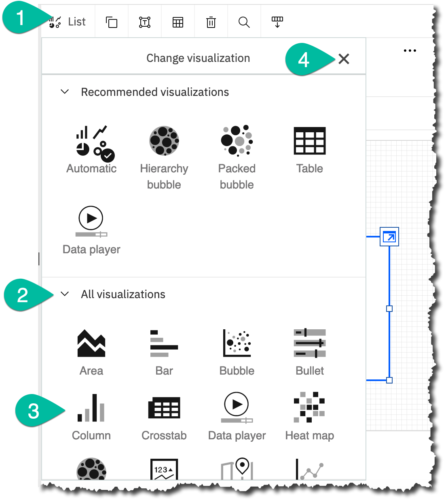
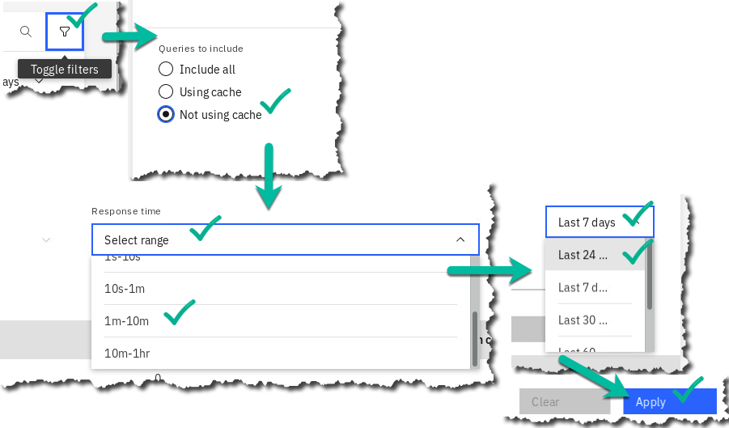
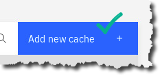
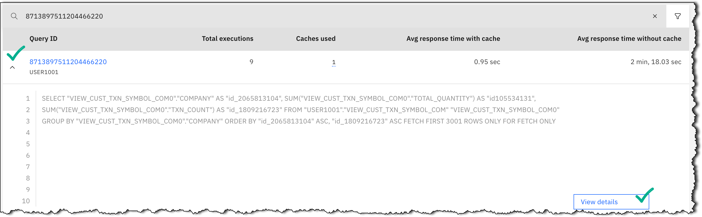

# Collect: Data Virtualization Caching - Deeper Dive

## Lab overview

IBM Cloud Pak for Data (CPD) is a robust, fully integrated platform that will improve business agility and decrease the cost of creating high quality, impactful Analytics.

 Data Virtualization (DV), an important component of IBM Cloud Pak for Data, helps integrate data sources across multiple types and locations and turn them into one logical data view. This virtual data lake decreases the amount of time needed to get value out of your data. With data virtualization, you can query data across many source systems without having to copy and replicate the sources into a centralized repository, which saves time and reduces cost. It simplifies your analytics and provides "current state of the business" answers because you're querying the data at its source with all its respective policies enforced. One can create virtual objects in DV, pointing to the original data sources to be used in queries as if they were local objects. Each query executed against these virtual objects gets efficiently compiled and optimized to work directly with the source data. The query times and performance will be dictated by latency and the workload on the underlying data sources, especially while performing aggregated queries across different data sources.

With Data Virtualization Caching, it is possible to avoid trips to the original source(s) and create a temporary cache of the data. This helps immensely with query performance as the DV optimizer can choose to use the local cached copy instead of querying the remote sources repeatedly.

In this lab, you will create Data Virtualization objects that will be used within a dashboard to perform analysis followed by using the caching capability of DV to experience how query times can be drastically reduced. You will also learn how caches can be refreshed, disabled, enabled and deleted, and the best practices and guidelines to create DV Caches.

In our scenario, the Trade Co. Business Analyst (BA) initially creates a dashboard using data from a DV view, which in turn points to multiple remote data sources underneath. But rendering these dashboards and using them for analysis takes a very long time since the data has to be retrieved every time from those remote data sources. The BA works with the DV Admin, who helps create a cache for the virtualized view to help address the data retrieval performance issues observed while working with the dashboard.

## Personas represented in this lab

The Business Analyst persona along with the Data Engineer and Data Virtualization Administrator personas will perform the exercises in this lab.

| **Persona (Role)**  | **Capabilities** |
| :-: | :-- |
|     | Business Analysts deliver value by taking data, using it to answer questions, and communicating the results to help make better business decisions.                                                                                        |
|                                                                                                                                                                                    |                                                                                                                                                                                                                                            |
| Business Analyst                                                                                                                                                                   |                                                                                                                                                                                                                                            |
+------------------------------------------------------------------------------------------------------------------------------------------------------------------------------------+--------------------------------------------------------------------------------------------------------------------------------------------------------------------------------------------------------------------------------------------+
| {width="0.4in" height="0.4in"} | Data Engineers build and optimize the systems to allow data scientists and business analysts to perform their work. The Data Engineer ensures that any data is properly received, transformed, stored, and made accessible to other users. |
|                                                                                                                                                                                    |                                                                                                                                                                                                                                            |
| Data Engineer                                                                                                                                                                      |                                                                                                                                                                                                                                            |
+------------------------------------------------------------------------------------------------------------------------------------------------------------------------------------+--------------------------------------------------------------------------------------------------------------------------------------------------------------------------------------------------------------------------------------------+
| {width="0.4in" height="0.4in"}        | Administrators set up and maintain the DV module within the CPD environment itself. They are responsible for granting DV access to users and administration tasks such as creating a data cache.                                           |
|                                                                                                                                                                                    |                                                                                                                                                                                                                                            |
| Administrator (DV/CPD)                                                                                                                                                             |                                                                                                                                                                                                                                            |
+------------------------------------------------------------------------------------------------------------------------------------------------------------------------------------+--------------------------------------------------------------------------------------------------------------------------------------------------------------------------------------------------------------------------------------------+

> For convenience in doing this lab, instead of switching between personas, all the required privileges have been provided to the same user. The workbook will refer to the respective personas at different stages to help understand the flow of this task.

## Logging into the CPD web client (if you have not already done so)

1.  If you are starting this lab stand-alone (without going through previous labs) do the following:

2.  Double-click the desktop icon: Cloud Pak for Data Web Client.

{width="0.7914905949256343in" height="0.8936176727909011in"}

3.  The CPD web client GUI displays as shown. Use cpduser and cpdaccess for the *Username* and *Password* and click Sign in.

    {width="2.2121216097987753in" height="2.908131014873141in"}

## Reviewing the dashboard: Stock Trading Analysis - Trade Co.

In an attempt to understand stock trading patterns, the business analysis for Trade Co. starts by creating a simple dashboard to find the most popular historically traded stocks. The dashboard shows the number of Shares Sold vs. the number of Daily Trades.

{width="6.457446412948381in" height="2.6084951881014873in"}

The Business Analyst (BA) works with the Data Engineer (DE) to get virtualized access to the different data sources required for creating the dashboard(s). The DE creates the Data Sources, Virtual Tables and finally a Virtualized View joining all the Virtual Tables and computing the basic aggregations required. The View is then shared with the BA, who can then proceed with creating the dashboard.

However, once the dashboard is initially created, the BA notices delays in rendering it. Since every request from the dashboard has to fetch the data from its original source(s), latency starts to play an important role, slowing down response. The BA works with the Data Virtualization Admin to create a cache for the View, which helps speed up query times significantly and hence rendering of the dashboard(s).

## Virtualizing the remote tables and creating a view

The Data Virtualization process begins by adding data sources to virtualize and is typically done by the Data Engineer.

+------------------------------------------------------------------------------------------------------------------------------------------------------------------------------------+
| **Persona (Role)**                                                                                                                                                                 |
+====================================================================================================================================================================================+
| {width="0.4in" height="0.4in"} |
|                                                                                                                                                                                    |
| Data Engineer (DV/CPD)                                                                                                                                                             |
+------------------------------------------------------------------------------------------------------------------------------------------------------------------------------------+

### **Navigate to Data virtualization**

4.  Start at the Navigation Menu.

Click Collect Data virtualization.

{width="2.797871828521435in" height="1.1085903324584427in"} {width="1.950819116360455in" height="1.796806649168854in"}

**\
**

### **Create the PostgreSQL database connection**

5.  We will need to create a connection to a PostgreSQL table for use in this lab. Select Data Sources -- SQL editor and enter the following SQL:

call QPLEXSYS.setRdbcX(\'PostgreSQL\', \'03c07569-09f5-42d9-8135-c1d647c59920.btdl8mld0r95fevivv30.databases.appdomain.cloud\',\'32121\', \'ibmclouddb\', \'CryptoProtocolVersion=TLSv1.2\', \'ibm_cloud_7e30807a_5e03_4bb5_87f5_6550a69de7cd\',\'6627c6d6f8746916ec7fa3c0ade3d722297dfcd1e9b91cec7c53515e2efd1843\', \'1\', \'0\', \'\', \'\', \'qpendpoint_5:6419\', ?, ?, ?);

Note: You can also find this SQL to download/copy/paste here: <https://ibm.box.com/v/DV-CreatePostgreSQL>

6.  Select Run all to execute the SQL and create the connection in Data Virtualization.

{width="7.1in" height="2.65in"}

**\
**

### **Creating virtualized tables**

7.  With the data sources successfully created, the next step is to virtualize the tables needed for this exercise.

From the top left go to SQL editor Virtualize.

{width="1.9349748468941381in" height="2.564815179352581in"}

8.  In the search bar, enter the string STOCK and click the search icon (magnifying glass).

{width="3.671804461942257in" height="2.1666666666666665in"}

9.  Click the gear, then select Group tables with identical names.\
    {width="2.4907403762029747in" height="1.1116404199475065in"}

This uses the DV feature of "Schema Folding" which groups tables with the same names across data sources and shows them as a single "table" selection. (Notice how two tables called CUSTOMER_TRANSACTIONS from to different databases are treated as one.)

10. Select tables: CUSTOMER_TRANSACTIONS and STOCK_SYMBOLS Click Add to cart

View cart.

{width="2.8132939632545932in" height="1.8675492125984252in"} {width="1.2516557305336833in" height="1.390246062992126in"}

11. In the Review cart and Virtualize tables section, select button My virtualized data Uncheck box Submit to catalog Click Virtualize.

{width="6.3971839457567805in" height="1.1125in"}

12. Notice the **two** virtual tables you just created, which are actually comprised of three different tables in three databases in the IBM Cloud. The CUSTOMER_TRANSACTIONS virtual table is a schema folded table pointing to **two** remote Db2 Warehouse tables and the STOCK_SYMBOLS virtual table points to **single** table in the PostgreSQL database.

Click View my virtualized data.

{width="4.1123151793525805in" height="1.7585126859142608in"}

13. You will now be creating a virtualized view of these virtualized tables using the SQL editor.

Select Menu (My virtualized data) SQL editor.

{width="1.3964905949256343in" height="1.3178805774278215in"}

14. Copy and paste the SQL below into the SQL editor.

+---------------------------------------------------------------------------------------------------------------------------------------------------------------------------------------------------------------------+--------------------------------------------------------------------------------------------------------------------------------------------------------------------------------------+
| {width="0.36041666666666666in" height="0.36041666666666666in"} | Note: You can copy and paste this SQL directly from the Unified Desktop by using the File Browser to open this file:                                                                 |
|                                                                                                                                                                                                                     |                                                                                                                                                                                      |
| Data                                                                                                                                                                                                                | {width="0.5416666666666666in" height="0.5225164041994751in"} Home Downloads DVCaching_SQL.txt. |
|                                                                                                                                                                                                                     |                                                                                                                                                                                      |
| Engineer                                                                                                                                                                                                            | Alternately, you can download this file by opening a browser tab and using this link: <https://ibm.box.com/v/Workshop-V9-DVCashing-SQL>                                              |
+---------------------------------------------------------------------------------------------------------------------------------------------------------------------------------------------------------------------+--------------------------------------------------------------------------------------------------------------------------------------------------------------------------------------+

**DROP VIEW VIEW_CUST_TXN_SYMBOL_COM;**

> **CREATE VIEW VIEW_CUST_TXN_SYMBOL_COM**
>
> **AS**
>
> **SELECT**
>
> **\"SYM\".\"COMPANY\",**
>
> **\"SYM\".\"SYMBOL\",**
>
> **\"CUSTID\",**
>
> **\"TOTAL_QUANTITY\",**
>
> **\"TXN_COUNT\"**
>
> **FROM**
>
> **\"USER1001\".\"STOCK_SYMBOLS\" \"SYM\",**
>
> **(SELECT**
>
> **\"USER1001\".\"CUSTOMER_TRANSACTIONS\".\"CUSTID\" \"CUSTID\",**
>
> **\"USER1001\".\"CUSTOMER_TRANSACTIONS\".\"SYMBOL\" \"SYMBOL\",**
>
> **\"USER1001\".\"CUSTOMER_TRANSACTIONS\".\"TRANSACTION_DATE\"**
>
> **\"TRANSACTION_DATE\",**
>
> **SUM(\"USER1001\".\"CUSTOMER_TRANSACTIONS\".\"UNITS_TRADED\") as**
>
> **\"TOTAL_QUANTITY\",**
>
> **COUNT(\*) as \"TXN_COUNT\"**
>
> **FROM**
>
> **\"USER1001\".\"CUSTOMER_TRANSACTIONS\"**
>
> **GROUP BY CUSTID,SYMBOL,TRANSACTION_DATE) \"ST\"**
>
> **WHERE RTRIM(\"SYM\".\"SYMBOL\")= RTRIM(\"ST\".\"SYMBOL\");**

15. Click Run all which should create the virtualized view successfully.

{width="6.572830271216098in" height="5.4375in"}

+---------------------------------------------------------------------------------------------------------------------------------------------------------------------------------------------------------------------+---------------------------------------------------------------------------------------------------------------------------------------------------------------------------------------------------------------------------------------------------------------------------------------------------------+
| {width="0.36041666666666666in" height="0.36041666666666666in"} | Note: The first time this script is run, the DROP VIEW statement will fail since the view does not exist. It will execute cleanly on subsequent runs. {width="5.414893919510061in" height="1.9792136920384953in"} |
|                                                                                                                                                                                                                     |                                                                                                                                                                                                                                                                                                         |
| Data                                                                                                                                                                                                                |                                                                                                                                                                                                                                                                                                         |
|                                                                                                                                                                                                                     |                                                                                                                                                                                                                                                                                                         |
| Engineer                                                                                                                                                                                                            |                                                                                                                                                                                                                                                                                                         |
+---------------------------------------------------------------------------------------------------------------------------------------------------------------------------------------------------------------------+---------------------------------------------------------------------------------------------------------------------------------------------------------------------------------------------------------------------------------------------------------------------------------------------------------+

16. Preview the contents of the virtualized view to confirm the data is being correctly retrieved.

Go to Menu (SQL editor) My virtualized data.

{width="1.7008661417322835in" height="1.8263888888888888in"}

17. On the view you just created, VIEW_CUST_TXN_SYMBOL_COM, click the ellipses at the end of that line ... and then select Preview.

{width="4.069444444444445in" height="1.929643482064742in"}

+---------------------------------------------------------------------------------------------------------------------------------------------------------------------------------------------------------------------+----------------------------------------------------------------------------------------------------------------------------------------------------------------------------------------------------------------------------------------------+
| {width="0.36041666666666666in" height="0.36041666666666666in"} | It may take a minute or two for the view to render.                                                                                                                                                                                          |
|                                                                                                                                                                                                                     |                                                                                                                                                                                                                                              |
| Data                                                                                                                                                                                                                | If this step fails, check to make sure that you have copied the SQL code properly into the SQL editor and run it again. Keep in mind that a successful execution of the SQL may not necessarily mean the view was actually created properly. |
|                                                                                                                                                                                                                     |                                                                                                                                                                                                                                              |
| Engineer                                                                                                                                                                                                            |                                                                                                                                                                                                                                              |
+---------------------------------------------------------------------------------------------------------------------------------------------------------------------------------------------------------------------+----------------------------------------------------------------------------------------------------------------------------------------------------------------------------------------------------------------------------------------------+

18. The Virtualized View preview should render as below.

{width="5.375in" height="2.3273786089238846in"}

## Creating a project to work in

The Virtualized View referencing different data sources is now created. The Data Engineer will share the Virtualized View with the Business Analyst (BA) who can then work on creating the dashboard.

+--------------------------------------------------------------------------------------------------------------------------------------------------------------------------------------+
| **Persona (Role)**                                                                                                                                                                   |
+======================================================================================================================================================================================+
| {width="0.4in" height="0.4in"} |
|                                                                                                                                                                                      |
| Business Analyst                                                                                                                                                                     |
+--------------------------------------------------------------------------------------------------------------------------------------------------------------------------------------+

With the access to the Virtualized View in place, the BA begins to work on the dashboard by creating an Analytics Project.

19. Click Navigation Menu Projects New project.

{width="4.225in" height="1.879430227471566in"}

20. Choose Analytics project Next.

{width="6.5098436132983375in" height="2.1489359142607176in"}

21. Click on tile Create an empty project.

{width="6.230544619422572in" height="2.6375in"}

22. Provide a name of 'your initials-DV-Project' and description for the project and click Create.

{width="6.2944892825896765in" height="2.5125in"}

### **Adding the previously created DV view to the new project**

23. Start at the Navigation Menu Click Collect Data virtualization Menu (Data Sources) My virtualized data.

{width="4.75in" height="1.7069149168853894in"}

24. Check VIEW_CUST_TXN_SYMBOL_COM click Assign.

{width="4.93080927384077in" height="1.3542366579177603in"}

25. Choose your_initials-DV-Project (whatever you have named it) Assign.

{width="6.1625in" height="1.9179461942257219in"}

26. The DV View is now successfully assigned to the project.

Click Go to project.

{width="5.31875in" height="2.6552132545931757in"}

27. On the Project page, click the Assets tab.

Review the Data assets section where the newly assigned virtualized view should now show up, along with the Connection it needs in order to render it from the data sources. (Your connection Name will vary from what is shown below.)

{width="4.319149168853893in" height="3.4826946631671043in"}

### **Creating a dashboard within the project to use the data asset:**

28. Click + Add to project and choose Dashboard as the asset type.

{width="5.68797353455818in" height="2.775in"}

29. Under *Name* type: Company Stock Analysis Create.

{width="6.125314960629921in" height="2.5348523622047243in"}

30. Choose the Freeform (default) layout OK.

{width="6.657364391951006in" height="3.1125in"}

31. On top left of the dashboard canvas in Selected sources and click + (Add a source).

{width="3.7234044181977253in" height="1.9538396762904637in"}

32. Click Data Assets USER1001.VIEW_CUST_TXN_SYMBOL_COM Select.

{width="5.927607174103237in" height="2.2553193350831147in"}

33. Click the newly added data source to expand the view to see the columns available to be used in the dashboard.

{width="4.1in" height="1.7982458442694662in"}

34. Drag and drop the COMPANY column on the canvas.

(It may take a minute or two for this column to render as a widget -- please be patient.)

{width="4.375in" height="2.8007020997375327in"}

35. Make sure to select the COMPANY widget on the canvas.

Then at the top right select the tab Fields.

{width="3.13128280839895in" height="1.7446806649168853in"}

36. On the top left (above Tab 1) change visualization type from list to column by selecting:

List box All visualizations Column.

Then close the visualization select box X.

{width="4.941674321959755in" height="5.5125in"}

37. On the right of the screen, you should see this visualization formatting box.

{width="1.9293307086614173in" height="2.4696970691163607in"}

38. Format the visualization by performing these steps, in order:

1\. Make sure the COMPANY column is used for Bars (if it is not, drag it there).

2\. Drag and drop the TXN**\_**COUNT column or Color.

3\. Drag and drop the TOTAL**\_**QUANTITY column for \# Length.

{width="4.803030402449694in" height="3.4018832020997376in"}

39. Click the Save icon to ensure your work is saved.

{width="1.215521653543307in" height="1.075in"}

40. Perform some analysis of various companies to see the quantity traded and the transaction counts by hovering on an individual company from within the visualization.

Example: hover over the column for International Business Machines Corporation.

{width="6.560265748031496in" height="4.9125in"}

+---------------------------------------------------------------------------------------------------------------------+---------------------------------------------------------------------------------------------------------------------------------+
| {width="0.4in" height="0.4in"} | I noticed a delay while retrieving my data in this dashboard which in the long run will be unsuitable for me to use repeatedly. |
|                                                                                                                     |                                                                                                                                 |
| Business Analyst                                                                                                    | I need to reach out to my CPD Administrator and Data Engineer to find a way to make this perform better.                        |
+---------------------------------------------------------------------------------------------------------------------+---------------------------------------------------------------------------------------------------------------------------------+

## Creating the Data Virtualization cache

### **Creating the DV data cache**

+-----------------------------------------------------------------------------------------------------------------------------------------------------------------------------+
| **Persona (Role)**                                                                                                                                                          |
+=============================================================================================================================================================================+
| {width="0.4in" height="0.4in"} |
|                                                                                                                                                                             |
| Administrator (DV/CPD)                                                                                                                                                      |
+-----------------------------------------------------------------------------------------------------------------------------------------------------------------------------+

The DV Admin will first analyze the queries executed against DV and identify those generated by the dashboard. Looking at the query will help understand what type of cache needs to be created to improve performance for a better dashboard experience.

41. Start at the Navigation Menu.

42. Click Collect Data virtualization Menu (Data Sources) Cache Management.

{width="4.518319116360455in" height="2.0770833333333334in"}

43. You will be presented with your Cache management dashboard.

{width="5.474936570428697in" height="2.6625in"}

44. Click tab Queries.

{width="2.640536964129484in" height="1.3936165791776027in"}

45. At the far right of the screen select Filter Not using cache Response time: 1m-10m Last 24 hours Apply.

{width="6.491836176727909in" height="3.8116688538932633in"}

46. The list of queries executed are shown with their average execution times if run more than once. Note the response time which explains the delay in working within the dashboard. (The example below is greater than 1 minute and 10 seconds)

Select the down arrow by first Query ID to see the actual SQL being run.

NOTE: If the query you chose does not contain 'SELECT VIEW_CUST_TXN_SYMBOL_COM at the start of the query, use the back-arrow key to return to the cache, scroll down and view another query.

{width="6.538893263342082in" height="3.0833333333333335in"}

Click View details.

{width="1.4166666666666667in" height="0.5486111111111112in"}

47. Record (or screen shot) the Query ID, which will be used later in this lab. (Often, recording only the last 6 digits is all that is necessary.)

    {width="2.201388888888889in" height="1.3773720472440945in"}

One could choose to create a cache from this particular query, but since the dashboards will be using all columns from the View created anyway, the DV Admin and the BA decides to create a cache for the entire virtualized view instead.

48. Go back the main Cache Management page and click Data caches.

{width="3.2384120734908137in" height="1.0794706911636045in"} {width="2.3934416010498687in" height="1.455103893263342in"}

49. At the right of the page, click Add new cache.

{width="2.2446806649168853in" height="1.0693547681539808in"}

50. This opens a SQL Editor to enter the query from which the cache will be created.

Type in the query to select all columns from the virtualized view:

**SELECT \* FROM \"USER1001\".\"VIEW_CUST_TXN_SYMBOL_COM\"**

Click Next.

{width="5.787234251968504in" height="1.1383147419072617in"}

51. In the Refresh rate choose the default (None, manual only) and click Next.

{width="5.279165573053368in" height="2.2234044181977253in"}

52. Enter your initials at the end of the Cache name (yours may vary) then confirm the details on the final page.

Click Create.

{width="2.540579615048119in" height="0.8609273840769903in"} {width="2.3625in" height="0.8127001312335957in"}

The cache creation process may take some time and the main Cache Management page will reflect the work in progress.

{width="6.4125in" height="3.20374343832021in"}

53. Once the cache creation is complete, the newly created cache shows up under the Active data caches along with other details and its size.

{width="6.28803258967629in" height="0.925in"}

+------------------------------------------------------------------------------------------------------------------------------------------------------+----------------------------------------------------------------------------------------------------------------------------------------------------------------------------------------------------------------------------------------------------------------------------------------------------------------------------------------------------------------------------+
| {width="0.36041666666666666in" height="0.36041666666666666in"} | KNOWN ISSUE -- There exists a defect/issue wherein queries executed before the cache is created and activated fails to use the cache. This is because the query plan is already cached in a relational database such as Db2, so the work around is to clear the Db2 package cache and collect table statistics on the virtual tables created above. You will do that next. |
|                                                                                                                                                      |                                                                                                                                                                                                                                                                                                                                                                            |
| Admin                                                                                                                                                |                                                                                                                                                                                                                                                                                                                                                                            |
+------------------------------------------------------------------------------------------------------------------------------------------------------+----------------------------------------------------------------------------------------------------------------------------------------------------------------------------------------------------------------------------------------------------------------------------------------------------------------------------------------------------------------------------+

54. Click Menu (Cache management) SQL Editor.

{width="2.5125in" height="3.5312882764654416in"}

55. Remove the view SQL and replace it with the following:

**FLUSH PACKAGE CACHE DYNAMIC**

Click Run all.

{width="5.595744750656168in" height="1.7377241907261591in"}

In a production setting, flushing the entire package may not always be a good idea as it could affect query execution for all users of the database. (We did it here to make this lab simpler.)

Instead, one could opt to selectively flush the package corresponding to particular queries. For more details on that see: <http://ibm.biz/FLUSH-PACKAGE>.

*\
*

56. Next, check if the table statistics have been collected. Replace the previous SQL with:

**SELECT TABNAME, STATS_TIME, CARD , TYPE**

**FROM SYSCAT.TABLES**

**WHERE TABSCHEMA=\'USER1001\'**

**AND**

**TABNAME**

**IN (\'STOCK_SYMBOLS\',\'CUSTOMER_TRANSACTIONS\');**

+---------------------------------------------------------------------------------------------------------------------------------------------------------------------------------------------------------------------+-----------------------------------------------------------------------------------------------------------------------------------------------------------------------------------------------------------------------------------------------------------------------------------+
| {width="0.36041666666666666in" height="0.36041666666666666in"} | Note: You can copy and paste this SQL directly from the Unified Desktop by using the File Browser to open this file:                                                                                                                                                              |
|                                                                                                                                                                                                                     |                                                                                                                                                                                                                                                                                   |
| Data                                                                                                                                                                                                                | {width="0.5416666666666666in" height="0.5225164041994751in"} Home Downloads DV_SelectTabname.txt. |
|                                                                                                                                                                                                                     |                                                                                                                                                                                                                                                                                   |
| Engineer                                                                                                                                                                                                            | Alternately, you can download this file by opening a browser tab and using this link: <https://ibm.box.com/v/DV-SelectTabname>                                                                                                                                                    |
+---------------------------------------------------------------------------------------------------------------------------------------------------------------------------------------------------------------------+-----------------------------------------------------------------------------------------------------------------------------------------------------------------------------------------------------------------------------------------------------------------------------------+

57. Click Run all.

{width="5.904255249343832in" height="2.442782152230971in"}

If the cardinality for the virtual tables created before shows -1, this indicates that table statistics have not been collected. These statistics will be collected now.

{width="5.351064085739282in" height="1.9433202099737532in"}

+---------------------------------------------------------------------------------------------------------------------------------------------------------------------------------------------------------------------+---------------------------------------------------------------------------------------------------------------------+
| {width="0.36041666666666666in" height="0.36041666666666666in"} | Note: The SYSPROC.NNSTATS is a procedure to collect statistics for remote tables: <http://ibm.biz/SYSPROC-NNSTATS>. |
|                                                                                                                                                                                                                     |                                                                                                                     |
| Data                                                                                                                                                                                                                |                                                                                                                     |
|                                                                                                                                                                                                                     |                                                                                                                     |
| Engineer                                                                                                                                                                                                            |                                                                                                                     |
+---------------------------------------------------------------------------------------------------------------------------------------------------------------------------------------------------------------------+---------------------------------------------------------------------------------------------------------------------+

58. If your statistics are not current, then do this step. If they are current, you can skip this step.

    **CALL SYSPROC.NNSTAT(NULL, \'USER1001\',**

    **\'CUSTOMER_TRANSACTIONS\',\'\', \'\',2,\'/tmp/collstats1.log\',?,1);**

    **CALL SYSPROC.NNSTAT(NULL, \'USER1001\',**

    **\'STOCK_SYMBOLS\',\'\', \'\',2,\'/tmp/collstats1.log\',?,1);\
    **

+---------------------------------------------------------------------------------------------------------------------------------------------------------------------------------------------------------------------+---------------------------------------------------------------------------------------------------------------------------------------------------------------------------------------------------------------------------------------------------------------------------------+
| {width="0.36041666666666666in" height="0.36041666666666666in"} | Note: You can copy and paste this SQL directly from the Unified Desktop by using the File Browser to open this file:                                                                                                                                                            |
|                                                                                                                                                                                                                     |                                                                                                                                                                                                                                                                                 |
| Data                                                                                                                                                                                                                | {width="0.5416666666666666in" height="0.5225164041994751in"} Home Downloads DV_CallSysProc.txt. |
|                                                                                                                                                                                                                     |                                                                                                                                                                                                                                                                                 |
| Engineer                                                                                                                                                                                                            | Alternately, you can download this file by opening a browser tab and using this link: <https://ibm.box.com/v/DV-CallSysProc> .                                                                                                                                                  |
+---------------------------------------------------------------------------------------------------------------------------------------------------------------------------------------------------------------------+---------------------------------------------------------------------------------------------------------------------------------------------------------------------------------------------------------------------------------------------------------------------------------+

59. Click Run all.

    {width="5.652753718285214in" height="1.9306933508311461in"}

60. To confirm if the table statistics have now been collected, replace the previous SQL with the following:

    **SELECT TABNAME, STATS_TIME, CARD , TYPE**

    **FROM SYSCAT.TABLES**

    **WHERE TABSCHEMA=\'USER1001\'**

    **AND**

    **TABNAME**

    **IN (\'STOCK_SYMBOLS\',\'CUSTOMER_TRANSACTIONS\');**

61. Click Run all.

    {width="6.049504593175853in" height="1.526576990376203in"}

    The actual rows counts for the virtual tables are shown as expected instead of -1.

    With the package cache flushed and the table level statistics collected, all queries henceforth referencing the virtualized view should start using the cached copy instead of accessing the underlying data sources directly.

    The DV Admin informs the BA about the cache creation and asks the BA to re-run the dashboard.

+--------------------------------------------------------------------------------------------------------------------------------------------------------------------------------------+
| **Persona (Role)**                                                                                                                                                                   |
+======================================================================================================================================================================================+
| {width="0.4in" height="0.4in"} |
|                                                                                                                                                                                      |
| Business Analyst                                                                                                                                                                     |
+--------------------------------------------------------------------------------------------------------------------------------------------------------------------------------------+

62. Return to the dashboard created previously.

Navigation Menu Projects your_initials-DV-Project Assets Dashboards Company Stock Analysis

63. The dashboard should now render faster with much better response times while analyzing the stock data. The queries executed by the dashboard against the virtualized view now use the DV cache.

64. Return to Data Virtualization, to Menu Cache Management Queries to get some insights into the queries you just ran.

*Note:* Because there is sometimes a slight delay in getting all the information about the latest queries and cache info via the UI, you can search for the query by Query ID (that you hopefully noted in the previous step.)

Click on the Search (magnifying glass) icon.

{width="6.430555555555555in" height="0.9377898075240595in"}

Enter the Query ID to list the query.

{width="6.4845680227471565in" height="1.5in"}

65. Expand the entry to view the query details.

{width="6.409285870516185in" height="1.9847222222222223in"}

66. Click on View details to show the number of executions and execution times.

{width="6.361160323709536in" height="2.924242125984252in"}

Notice in the above example (yours may vary somewhat) the query took under 1 second to run with the cache, while without cache it was 2 minutes and 18 seconds.

67. Confirm that this is the same query that was executed in the previous steps, by confirming the Query ID and by clicking on SQL.

{width="6.393939195100613in" height="2.876147200349956in"}

The query execution time has reduced **significantly** with the cache now being utilized instead of fetching the data from the underlying sources!

The cache hits should also start showing up under Cache Management Data caches.

{width="6.25794728783902in" height="0.9083333333333333in"}

## Reviewing the Cache Management UI

> The Cache Management UI helps the DV Admin to create, monitor and manage caches. It provides information about the active/inactive caches like size, hit counts etc. along with options to work with them.
>
> {width="6.575in" height="2.150508530183727in"}
>
> The UI also provides details about the queries executed against DV. This is particularly useful for the DV Admin in identifying slow running queries and potentially creating caches to make them run faster.
>
> Play with some of the features of the Query section using Filters.
>
> {width="6.651515748031496in" height="1.8970866141732283in"}

## Refreshing the Data Virtualization cache

> As data changes in the underlying data sources, it is important to refresh the cache and reflect the freshly updated data. The cache creation process provides an option to set the cache refresh rate.
>
> {width="3.2407403762029747in" height="3.067367672790901in"}
>
> One can choose from the following options in the drop down:

1.  *None, manual only:* After the initial refresh, all subsequent refresh has to be manually performed by the DV Admin.

2.  *Hourly:* The cache gets refreshed hourly on the set minute of the hour.

3.  *Daily:* The cache gets refreshed at a specified time of day.

4.  *Weekly:* The cache gets refreshed at a specified time on specific day(s) in a week.

5.  *Monthly:* The cache gets refreshed at the specified time on specific day(s) and week(s) in a month.

> To avoid delays and unexpected results, the best time to refresh the cache should be chosen based on the lowest DV usage/low query traffic.

## Deactivating/Activating/Deleting the Data Virtualization cache

> The Cache Management UI provides some options to help manage caches. After a cache is created, it gets refreshed/populated by data and remains in the active state by default, to be considered by the Query Optimizer while generating the query plans.
>
> {width="5.231481846019247in" height="2.044699256342957in"}
>
> An active cache can be deactivated so the Query Optimizer will not consider it while generating the query plans. This could be useful if there are issues related to the cached data and needs investigation.
>
> A cache can be deleted, which moves it into the inactive state and eventually cleaned up. The list of deleted caches can be listed using the Deleted caches option. It shows the original cache details and if needed, you could re-create them.
>
> {width="5.425926290463692in" height="2.120696631671041in"}
>
> {width="5.398148512685914in" height="2.152607174103237in"}

## Caching guidelines

> The DV cache is a very useful feature for improving DV query performance. However, there are some important points to remember:

1.  The DV cache can only be created by the DV Admins.

2.  A cached object has the same permissions as the underlying DV object.

3.  Use queries that perform some sort of aggregation from the underlying data to create the cache. Performing aggregations help create summaries, and thus limit data cached.

4.  When possible avoid duplicating data that exists in its original form in the underlying data sources.

5.  Identify the most commonly used query or parts of queries and consider creating the cache from them. That way multiple users and queries can benefit from those caches.

6.  Limit the size of the data to be cached. Note that the cache uses the storage allocated to the DV instance, hence it is common to all DV users. Large caches will limit the availability of space for other users/scenarios.

7.  Time taken to refresh a cache will depend on the amount of data, latency and availability of the underlying data sources.

8.  A cache will not be used for a query if there is no match for the statement or column(s) and the virtual object being queried.

9.  The DV Cache Management UI takes couple of minutes to refresh the queries executed, cache hit counts and other relevant information.

## Lab conclusion

Data Virtualization (DV), as part of the Collect phase, facilitates accessing data from various data sources and running queries across them. Since data movement is limited, all of the access rules and policies for creating copies remain preserved. In situations where query response times are paramount, DV provides the caching facility, which was covered in this lab.

**\*\* End of Lab 11 - Collect: Data Virtualization Caching -- Deeper Dive**

Lab by Rajesh Kartha, Edited by Burt Vialpando and Kent Rubin
