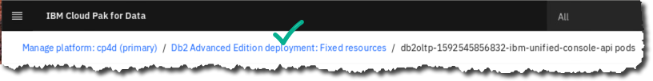
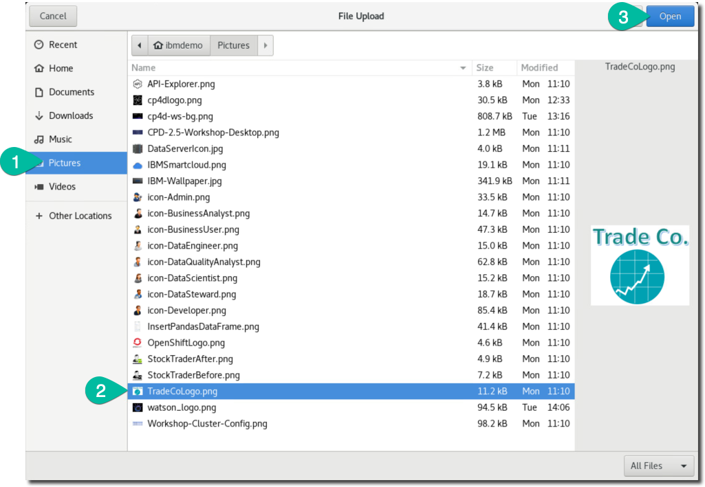
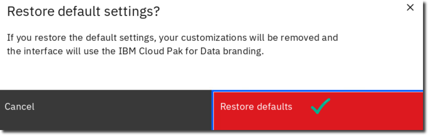

# Getting Started

## IBM Journey to Cloud and AI: Analytics Modernization Workshop

This workshop provides hands-on experience with Cloud Pak for Data that will show you how to modernize your microservices applications by enriching them with Machine Learning (ML) and Artificial Intelligence (AI).

The Journey to AI requires a strong information architecture (IA) that supports self-service capabilities and balances the needs of both the agility required by lines of business as well as the "Enterprise class" delivery required by IT. This journey can move significantly faster and with more efficiency when you use a single integrated platform like Cloud Pak for Data. It is the world's leading platform that allows you to Collect, Organize and Analyze data, and then Deploy the results to Infuse your applications with AI.

## Cloud Pak for Data: defined

Cloud Pak for Data (CPD) is an integrated end-to-end data and analytics platform designed to help make data more accessible and trusted, as well as to provide access to many analytical tools to help your organization gain insights from your data.

CPD provides the data platform that accelerates the journey up the "AI Ladder." With it, you can quickly build, train, deploy, and manage machine learning (ML) models to create applications with Artificial intelligence (AI). CPD provides inventory and cataloging of your data sources, self-service shopping for data, and data integration and refinement capabilities. Thus, high quality and trusted data can be more easily prepared, assembled and used in one modern, integrated, collaborative and scalable platform.

Cloud Pak for Data is installed on the foundation of OpenShift for the cluster this workshop uses.

## OpenShift: defined

[Red Hat OpenShift](https://www.openshift.com/) is an open, hybrid cloud Kubernetes platform used to build, run, and scale container-based applications. OpenShift itself is built upon a foundation of Red Hat Enterprise Linux. OpenShift includes everything you need to manage your development lifecycle, including standardized workflows, support for multiple environments, continuous integration, and release management.

Cloud Pak for Data can be installed and managed on public cloud platforms as well, including IBM Cloud, AWS, Microsoft and more.

## Lab workshop environment

> We are using a CPD cloud cluster for this workshop. This software environment was built with the following key software components:

-   Red Hat OpenShift Container Platform (RHOCP) 4.5 as the foundational cloud-native technology platform of Kubernetes and Docker, as well as other open-source tools.

-   Cloud Pak for Data v3.5.2 as the microservice-built, integrated data and analytics platform with various add-ons installed and enabled.

## Audience for this IBM workshop

This IBM workshop is aimed at the line-of-business professionals who are tasked to gain new insights from all available data -- regardless of its type and origin. The following personas who will be represented in the various labs will greatly benefit from this workshop:

 | **Persona** | **Capabilities** |
 | :-: | :-- |
 |  Administrator| Administrators set up and maintain the CPD environment itself. **Note:** while some of the Admin work can be done in the CPD web client, most of the Admin work on the cluster would be done in OpenShift which is outside the scope of this workshop. The exercises in this first lab represent some typical CPD Administrator activities.|
 |  Data Engineer| Data Engineers build and optimize the systems to allow data scientists and business analysts to perform their work. The Data Engineer ensures that any data is properly received, transformed, stored, and made accessible to other users. |
 |  Data Steward | Data Stewards bring integration and transformation of the data as well as providing governance, lineage and classification of the data.|
 |  Data Quality Analyst | Data Quality Analysts perform advanced curation of the data and analyze the quality of the data.|
 |  Business Analyst | Business Analysts deliver value by analyzing data to answer questions and communicating the results to help make better business decisions. |
 |  Data Scientist | Data Scientists bring expertise in statistics and the process of building ML/AI models to make predictions and answer key business questions.|
 |  Developer | Developers create and maintain the end-user applications that utilize the output from all the other personas on the CPD platform.|

## Getting started

1. To launch your CPD cluster,
1. The CPD web client GUI displays as shown below.
   Use cpduser and cpdaccess for the *Username* and *Password* and click Sign in.
    
1. You should now be at the Home Page.
    
1. Scroll down to review the quick navigation and resources links on this page. You will be exploring many of these in more detail in this workshop, so don't follow these links right now.
   
1. If you do happen leave this page by clicking on a link and you want to return to it, you can do so by clicking:
  - Navigation Menu ("hamburger" icon)
  - Home  
1. You can, of course, also use the browser back and forward arrow keys to navigate through main screens in the CPD web client.

   | **Persona** | **Capabilities** |
   | :---: | :--- |
   |  Admin | In this workshop, we will demonstrate the Collect, Organize and Analyze capabilities to create a machine learning model that you can Deploy and then Infuse into a microservices application.  CPD is very much "persona driven" in that each user can play their particular part in your organization's journey to AI. Each user can hand off and/or share their work with other users/personas, for a totally collaborative environment. |
1. Click back to the Users section and then click on Configure LDAP. You can review the fields required to do this here.

   | **Persona** | **Capabilities** |
   | :---: | :--- |
   |  Admin | For the sake of simplicity, you will remain logged into the CPD web client throughout this workshop as the user cpduser, which has been granted all persona roles. This was done so that you will not be required to log off and log on again as different users to represent the varying personas as you make your way through each lab. In your organization, however, it is likely that once you have a mature CPD environment set up, separation of duties will be defined by persona where different users will be assigned one or more personas to do their particular tasks. |

##  Managing platform options

You can view the underlying OpenShift services and pods by doing the following:

1. Click Navigation Menu Administer Manage platform.
 
1. In the Search area, type db2.
1. Click the deployment link Db2 Advanced Edition.
 
1. Under the tab Fixed resources, notice the Deployment CPU and Memory usage.
 - Click on any Deployment to review the pods for it.
   
1. The next screen shows the underlying OpenShift/Kubernetes pods for this deployment. (Your pod names will differ.)
  
1.. Click on Fixed resources in the bread crumb line (or use the back arrow).
  
1. Click on tab Service Instances.

This shows how many instances of the Db2 Advanced Edition have been created using the Db2 Advanced Edition deployment. In our case, it is only one.

We will review this instance in a different way later in this lab.

 

## Reviewing the profile settings

1. Click the top right circle of your web client screen that has your user icon on it. This provides a drop down.
 - Choose Profile and settings.
**Note** this is also the location where you can Log out of the web client)

1. Review the things you can change in your Profile, then review Permissions. **Note** in Permissions, your user has all permissions to allow you to do anything required in the workshop lab exercises. In the real world, your permissions would be more limited and controlled by an administrator.
  
1. Now review Git Integrations Generate API key and New token.
  

These allow you to configure Git with CPD, which allows you to integrate CPD projects with your current CI/CD (Continuous Integration and Continuous Delivery) pipeline to automate delivery of the artifacts you create in the CPD platform. You can use the capabilities from the underlying OpenShift platform to build cloud native microservice applications which are tied to the ML / AI model development with a delivery pipeline.

## Reviewing CPD services

1. Click the Services icon (four little squares over one bigger square) on the top right corner of your screen.
 
1. This will bring up all available services for Cloud Pak for Data. Click through the various categories to see what services you can install on CPD. For example, click on category AI and notice what is available there. Those with "Enabled" are accessible by this CPD cluster right now.
  
1. Now, click on the Watson Machine Learning service tile to get more details on what this service can do.
  
1. Click the browser back arrow to return to the Services catalog screen. (Or you can click on the Services catalog link in the breadcrumb trail itself)
  
1. Another convenient way to review these Services is to filter them in the Services Catalog options. Click through Pricing, Source and Status. In Status, check Enabled
   
1. This will show all the enabled services in your cluster (as long as you did not check a filter for Categories, Pricing or Source.)
  
1. Explore through this Services page to find a few capabilities that you might find useful for your organization. 
  |  Admin | IBM continues to provide more services with each release of Cloud Pak for Data. Some are part of the base offering, others are purchasable as IBM "cartridges," and still other are purchasable through a 3^rd^ party vendor. |

## Reviewing instances

1. Click Navigation Menu My instances.
  
1. Click tab Provisioned Instances and then click the twistie to sort the instances that were provisioned for this workshop.
   
  |  Admin | The term "instance" in this context means a copy of a persistent data store within the CPD platform. These instances are stateful Kubernetes services like Db2, MongoDB, Streams, Data Virtualization and even Cognos Analytics. |
1. Check the tabs for Environments and Jobs. Note: the cluster may not have any of these running at this time, so these pages could be empty. 
  | **Persona** | **Capabilities** |
  |:---:|:---|
  |  Admin | The term "environment" in this context means a copy of an analytics runtime that is running (taking up resources) on the cluster. These can be Jupyter/Python, Zeppelin/Anaconda, R Studio, Decision Optimization, etc. The term "job" in this context means a task scheduled within the platform. These can be analytics related (like a scheduled batch scoring job) or they can be a scheduled ETL or Streams job, etc. |

## Customizing branding

1. Click Navigation Menu Administer Customize branding.
   
1. In section Product name, click Custom name, then fill in TradeCo. Platform Services.
  
1. In section Home page logo, check Use your own logo.
  - Click on the box: Drop your JPG or PNG file here or browse for a file to upload.
  
1. For Browser Only: Download TradeCoLogo.png from <https://ibm.biz/BdqhHa>.
    -- For Unified Desktop: Under directory Pictures, select file TradeCoLogo.png Open.
   
1. Click button Apply.
  
1. Click Navigation Menu Home.
  
1. Notice the Navigation bar is customized, and the Home Page can have a company logo on it. **Note:** You may have to refresh your browser if it does not immediately show.
  
1. Let's reset this to the default setting so the rest of the lab workbooks will be consistent with your environment:
 - Click Navigation Menu Administer Customize branding, then Restore defaults Restore defaults.
  

## Lab conclusion

Cloud Pak for Data is useful in the following business macro use-case scenarios:

1.  **Manage Your Data Anywhere**: Use data virtualization, streaming, cataloging, governance and more to prepare your data for analysis.
1.  **Operationalize Data Science & AI**: Build, deploy, manage & govern models and data at scale to improve business outcomes like controlling customer churn, cross selling and up selling, predictive maintenance and more.
1.  **Shift to Next-Gen workloads**: Shift to Cloud Native to be able to provision and scale in minutes, build once and deploy anywhere with multi-cloud support, and use built-in automation and collaboration to increase productivity.
1.  **Smarter Governance:** Enable self-service analytics with auto-discovery of meta data, implementing governance rules and policies, enforcement of privacy to mitigate risk and to ensure compliance for regulatory requirements like GDPR.
 

Make Cloud Pak for Data your platform for data and analytics. Why? Because IBM understands data and provides an integrated, end-to-end data platform that enables enterprises to:

-   Collect relevant data and make it simple and accessible
-   Use federation, virtualization and/or transformation to combine and refine data sets
-   Organize data so it can be trusted
-   Analyze insights on demand
-   Infuse machine learning into your applications

All of the above and much more will be demonstrated in the following workshop labs.

**\*\* End of Lab 01 -- Getting Started**
