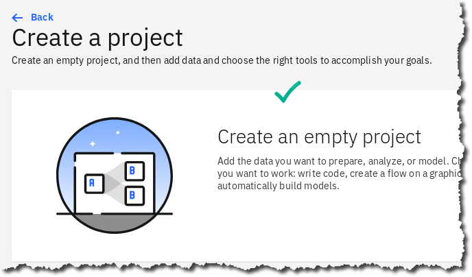
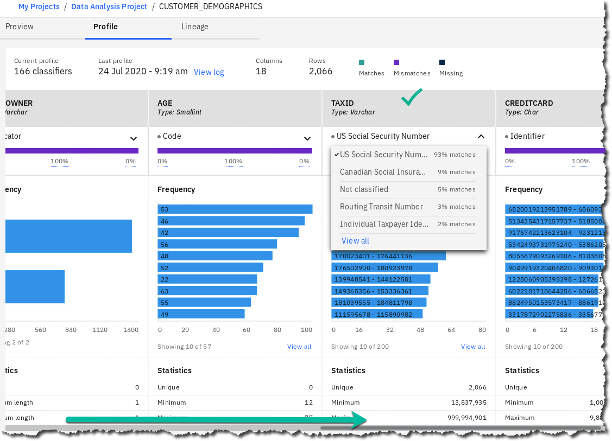

# Organize -- Deeper Dive

## Lab overview

Many organizations find it difficult to understand their own data because it originates from many sources, is dispersed across many silos, and is controlled by different teams.

This Organize lab will show you how to uncover the hidden data in your organization's data and how to build a lineage that is otherwise difficult to establish. Cloud Pak for Data helps your organization move from the manual processes required to establish relationships between data to an automated one aided by the platform's built-in machine learning capabilities.

## Personas represented in this lab

The Data Steward and Data Engineer personas are most likely to perform most of the Organize tasks shown in this lab.

 | **Persona** | **Capabilities** |
 | :-: | :-- |
 |  Data Steward  | Data Stewards integrate and transform the data, and provide governance, lineage and classification of the data.|
 |  Data Engineer | Data Engineers build and optimize the systems to allow data scientists and business analysts to perform their work. The Data Engineer ensures that any data is properly received, transformed, stored, and made accessible to other users. |

The Data Steward and Data Engineer personas often work closely together to prepare the data for analytics processing by other personas. For example, in this lab one of the things the Data Steward will do is to ensure Business Terms are assigned to data assets. In turn, the Data Engineer will then use that information to find the appropriate data to extract and transform to create a final table of the data sources joined together.

The Data Steward persona also works closely with the Data Quality Analyst persona.

## Logging into the CPD web client (if you have not already done so)

1.  If you are starting this lab stand-alone (without going through previous labs) do the following:
1.  Double-click the desktop icon: Cloud Pak for Data Web Client. 
1.  The CPD web client GUI displays as shown. Use cpduser and cpdaccess for the *Username* and *Password* and click Sign In. 

## Creating a connection to your data

 Data Connections are one of the primary ways that Cloud Pak for Data can access data both within the application and across various sources, including cloud, on-premises, application, semi-structured, etc. These connections can be created globally and then used by users within the different capabilities of the CPD platform.

1.  If you are starting this lab stand-alone (without going through previous labs) do the following: In the CPD web client, start at the Navigation Menu Click Connections. 
1.  Click New connection. 
1.  Before creating a connection, you will need to know the credentials to the database. You can find this by clicking on Navigation Home, Collect, then right click on My data and Open Link in New Tab. 
1.  Click on the tab Databases Click on the tile Db2 Advanced Edition Ellipse Details. 

    | **Persona** | **Capabilities** |
    | :-: | :-- |
    |  Data Steward | One of the advantages of using a full platform that uses containers and microservices is that you can have a host of capabilities that can be turned on, and with the correct user privilege, instances of those capabilities (like a new MongoDB or Db2 instance) can be created with the click of a button -- just as you would be able to do in a Public Cloud, but behind your firewall. |

1.  Page down to the bottom of the screen and you'll see the access information for our database. Copy down this information to enter in our Data Connections window.  
1.  Now return to the previous tab. 
1. Enter the parameters to create a connection to the internal Db2 database used for this workshop. Below is a sample; Connection Name and Description can be whatever you choose, the rest of the credentials you can get from the previous step. 

    | **Persona** | **Capabilities** |
    | :-: | :-- |
    |  Data Steward| **Note:** You may copy and paste the password as shown below. (if this doesn't work, then try highlighting the password and use \[CTL\]-c then \[CTL\]-v).   |

1. Click Test connection (to verify your credentials are correct).
1. That will return a successful message if the connection parameters are correct. 
1. Click the Create button to add the connection to CPD. At this point it is a 'Global Connection'. We will later add it to different projects, catalogs, etc. 

## Working in a project

 Working with Projects is an important part of the Cloud Pak for Data experience. Projects allow you to organize your work into specific areas to which you can control access, and once you are happy with the results, you can publish the assets and the findings to the Catalog for general user consumption.

1. Let's start by creating a project: In the CPD web client, click the Navigation Menu Projects Click New project. 
1. There are three primary types of projects you can create.
  - Click Analytics project Next. 
1. You can create an empty project,create a project by importing existing assets from your file system, or from a Git repository. Click tile Create an empty project. 
1. Add the Name and Description for your project.

    | **Persona** | **Capabilities** |
    | :-: | :-- |
    |  Data Steward| Note: You can also integrate the project to Git, which allows for automatic saves to a Git repository -- we won't be doing that today.|

1. Click Create. 

This will create a project and put you into the project overview screen. 

This screen shows summary information about who is a collaborator on this project, what assets have been created or exist in this project, etc. Along the top you see tabs for the different types of things we'll do with this Project, for example, Assets, Environments, etc.

### Adding a connection

Next, we'll start to bring data into our project so we can start to analyze, understand and enhance our data, to get it ready for publishing to a Catalog for public use.

1. Click Add to project. 
1. Choose Connection, and we will add the connection we created earlier. 
1. Here, you see a number of different choices for creating a connection. This is one of the strengths of CPD -- the breadth of different types of data you can access directly from the platform. As we said, we're going to add the connection we created earlier. Choose From global Db2_Source_Local. 

    | **Persona** | **Capabilities** |
    | :-: | :-- |
    |  Data Steward | **Note:** If this message appears, click the X 

1. Click Test (to validate we can connect to our data source),
1.lick Create. 

### Adding connected data

1. You've now added your first asset to the project (a connection). Next we'll want to use that connection to bring in some data and start to analyze and understand it. Once again, click Add to Project**.** 
1. Notice you can also add files directly from your desktop, by either dragging or browsing your file system. Now choose Connected data. 
1. Click Select source. 
1. Next, we'll choose our Connection, Schema, and Table(s). First, click Db2_Source_Local (or the name of your connection). We are interested in two tables, that are in two different schemas. Choose the schema CPDUSER CUSTOMER_DEMOGRAPHICS Select. 

1. Now we'll give it a name to refer to it by in our project. Enter CUSTOMER_DEMOGRAPHICS for the Source name Create. 
1. You've now added your first data asset to the project! Let's add a second table from another schema. Once again, click Add to Project**.** 
1. Choose Connected data again. 
1. Click Select source. 
1. Now select -- Db2_Source_Local SOLUTIONS CUSTOMER_ACTIVITY then Select. 
1. Name the asset CUSTOMER_ACTIVITY Create. 
1. When complete, your assets list for your project should contain 3 assets; two tables and a connection. 

### Exploring and Profiling data

One of the most powerful capabilities of Cloud Pak for Data is its ability to automatically create descriptive information, business classifications, etc., about your data. This information will then be exploited to do things such as determine where sensitive information is, decide how we should handle such information, describe who can see it and who cannot, assign business terminology to the data to make it easy for business users to locate and understand, and a whole host of other capabilities.

1. Next we'll start to get an understanding of our data; click on the CUSTOMER_DEMOGRAPHICS table. 
1. This will bring up a preview window showing you a sample of our data, and a number of options to work with it. Take a minute to familiarize yourself with this screen. 
1. The first thing we'll do is profile the data; profiling is a common practice of inspecting the data to understand basic characteristics of your columns such as frequency distributions, formats, completeness, etc. In Cloud Pak for Data, you will see that it goes a lot further than that...
1. Click the tab Profile.  **NOTE:** This will open the profile launch window.
1. First, click Select Data Classes. 
1. This will show a list of all "out of the box' data classes that can be assigned automatically during profiling to the different data columns. (Sometimes this does not populate -- if so, Cancel and reselect.) This window allows you to de-select certain classes if they aren't pertinent to your business or to this profiling exercise. For now, we will leave them all active. In addition, custom data classes can be defined for your business and added to this repository. Click Cancel (to return to the profile launch screen). 
1. Now click Create Profile. 

    | **Persona** | **Capabilities** |
    | :-: | :-- |
    |  Data Steward| **Note:** The profiling process will launch. This will take a few moments to complete so feel free to leave this screen and return, but it should only take between 2-3 minutes.  Click refresh on the browser to see if it finished. |

1. When it is complete, you will see: 
1. This is a bird's eye view of the results that have been generated by the profile run. Note that you can immediately determine frequencies and pay attention to the data classes that have been identified. Here we are looking at Gender, which was automatically determined during profiling based on the column metadata and the data itself. Scroll right to see other columns, like TAXID... 
1. Click back to the section Preview. 
1. Click on the down arrow for TAXID to see how Profiling found the identifier: US Social Security Number. 

### Refining visualizations

The next steps will allow us to use visualization techniques to further get an understanding of our data; visualization is a powerful way to get quick insights and make decisions about what we want to do next.

1. Click Refine. 

    | **Persona** | **Capabilities** |
    | :-: | :-- |
    |  Data Steward | **Note:** If you receive this error, back up in the browser and refresh to fix.  |

1. Click Visualizations Map. **NOTE:** You may need to click the double drop down arrow to expand the list of visualizations to find Map. 
1. Fill in the Details as shown below. 
1. Use your mouse's wheel to zoom in and center the United States on the visualization. Hover over any circle on the map, which indicates the Estimated Income by that City. 
1. If the Data Scientist or Business Analyst want to keep a visualization, they can download it by clicking on the image icon shown. Then, they can either save it, or review it with Open with Image Viewer (depending on browser and OS). 
1. Close the Image viewer (if you have it open) and click on the Data tab to return to your data view (you may see a popup asking if you want to leave the page after clicking Data. If so, choose yes). 

### Data refinery flows

You should now be back at the data grid view page. (See below)

Data Refinery flows are a powerful way to make adjustments to your data, in a visual, self-service environment. As you choose steps, it will create a pipeline process; each step is reversible and editable as well so that you may back up in case of error.

1. Click Refine if you are not already in the Data Refinery Flow Editor. 
11. The screen will refresh with a slightly different look; you'll still have your data grid, but you'll also see some new options for 'Operation', 'Steps', etc. 
1. You have been working in what is known as the Data Refinery. This module gives you many different capabilities for transforming, or "shaping" your data, using an easy to understand spreadsheet and menu-driven function paradigm. The first thing we want to do is scroll over to our two zip code fields, ZIP and ZIP4. Note that the zip field sometimes contains only 4 digits instead of 5. This commonly happens when the field at some point was defined as numeric and the leading digit is a zero -- it automatically gets dropped. Many east coast regions have zip codes that start with zero -- we'll want to pad the field to get the 0 back. Secondly, we'll want to pad all ZIP4 fields to have 4 zeros if there is a zero in the field.
1. Click on the ellipses next to the ZIP4 field. This will bring up a floating menu with a number of actions, or what we call operations, that you can use to transform our zip field. Some commonly used functions are called out directly, but we want to pad, so... Click on View All.  *Tip: Use your browser zoom in/out feature to see the View All option.*
1. Now we see all of the shaping operations by category on the left, and the column we're concentrating on, ZIP4. We're making a text transformation to pad missing numbers with zeros, so click Text. 
1. Next, we choose the operation -- click the dropdown below Text Operation. Choose Pad Characters. 
1. This brings up a window where you put in the parameters for padding characters. This function takes 3 parameters -- Side to pad: (Right), what the length of the resulting field should be (4), and what pad string to use: (0). Here are the parameters you should choose: 
1. After entering these parameters, click the Apply button. This will take you back to the data grid, and our field ZIP4 will now be padded if necessary. 
1. We're now going to do a similar thing to the ZIP field. We want to pad the zip field with a zero, if necessary, to make the field 5 characters. *Don't look at the screenshot below!* Try it on your own first -- but if you're struggling, the screenshots below should help. 
1. When you click Apply you're returned to the data grid. Scroll over to ZIP and verify the leading zeros are in place: 
1. What's also great about refinery is that as you add operations it keeps a list of those operations, in easy to understand English, not code -- and you can delete a step at any point by clicking the garbage can on that step -- the data will revert back to its state prior to the step. 
1. Now that we've built a pipeline with two steps, we want to run it so we can persist the data somewhere. To do that, we save the pipeline as a "job". Click the down arrow icon next to the clock and play arrow icons, then click Save and Create a Job. 
1. Next we need to name the job and then run it. Enter the name Clean-Zips Create and Run. 
1. The job takes about a minute to complete. You can see it running on the screen. Hit the refresh icon to see the status more quickly. 

    | **Persona** | **Capabilities** |
    | :-: | :-- |
    |  Data Steward | Note: Due to an issue, the first attempt to run the job may fail; if so, just re-run and it should be successful. |

1. When Completed, you can check the logs of the job if you wanted to. This can be especially useful if the job is complex. This job is only a simple two step job so we will not review it now. 
1. Click on the breadcrumb trail to return back to the project. 
1. A new output was created from the Refine job. Click on it: CUSTOMER_DEMOGRAPHICS_shaped.csv. 
1. Scroll over to find the ZIP and ZIP4 columns. Notice the data is padded with four zeros when there was previously only one zero in ZIP4 and the ZIP field is left padded with a 0. 

  | **Persona** | **Capabilities** |
  |  :-: | :-- |
  |  Data Steward | The power of Refine can be used by more than just the Data Steward because it is launched from a Project, which enables many more personas the ability to shape and refine data assets that the Data Steward may have given them access to. This gives anyone the ability to explore and shape data on their own with self-service capabilities. If you need to make a permanent change to the data, for example, to write it back to a database from where it came, that is where Transform comes in. We will explore Transform later in this lab.|

## Reviewing the business glossary

Business Glossaries have been around in various incarnations for about ten years. They have enjoyed varying degrees of success. The problem with glossaries, and with data governance in general, is that it's too costly and manually-intensive to maintain and enhance these glossaries, and the associated metadata, etc., over a long period of time. Today you'll see how Cloud Pak for Data's Automation capabilities finally make well-maintained, value-added governance solutions a reality.

A business glossary consists of categories and terms.

Categories provide the logical structure for the glossary so that you can browse and understand the relationships among terms and categories in the glossary. Categories can be organized in a hierarchy based on their meaning and relationships to one another.

A Business Term is a word or phrase that describes a characteristic of the enterprise. Terms are the fundamental building blocks of the glossary. Each Business Term has a parent Category, but it can also be referenced by other Categories. When you create a Business Term, you need to provide a meaningful name. Business Terms can be assigned to other Business Terms, and to other asset types as well.

Business Terms can be associated with a variety of different data assets in your organization, from tables and columns and files and fields to policies, ETL processes, data models, etc. This makes it easy for business users to find what they are looking for using terminology they understand.

Let's explore some of the categories and terms that are pre-loaded into our environment.
1. Start at the Navigation Menu. Click Organize Data and AI governance Categories. 
1. Review a category already created for you to review. Click Customer Churn Category. 
1. Review the Business Terms and Policy for the Category.  Notice that on this page you could create a new Category, but do not do so. We will only be working with this one category.
1. Click Navigation Menu Organize Data and AI governance Business terms. 
1. Here you can edit or add new Business terms that are either in Published or Draft mode. Click on one to review it in more detail. 

  | **Persona** | **Capabilities** |
  | :-: | :-- |
  |  Data Steward | You can create your own Glossary with Categories and Business Terms manually or import them from a file. In addition, you can import Industry Models from IBM for industries such as finance, banking, healthcare, and insurance, and import them into CPD. See the services screen  then Industry solutions.  |

## Automation Capabilities -- Discovery, Classification, Term Assignment

As mentioned in the business glossary section, the key to successful data governance lies in the use of automation and machine learning techniques to make decisions, create relationships, and generally enhance the value, timeliness and accuracy of your data governance activities. What you'll be doing next is known as Auto Discovery. This is a process that will crawl the data you point it at, and do several things:

a.  *Classify the data* -- this is the process that will assign business classifications to your data elements.
b.  *Score the data* -- this will allow you to quickly understand how clean your data is.
c.  *Assign Terms to your data* -- this is where CPD will look at the data you're pointing to, take the business glossary terms, and based on both the data in the columns and the metadata and classifications already determined, assign a confidence rating to specific terms that it matches to the columns. You can set a threshold for when it automatically makes the connection between terms and columns, or you can use a workflow-driven review process to inspect the confidences and determine whether to assign or not.

1. Let's get started. Go to the Navigation Menu. Click Organize Curation Data discovery. 
1. This will bring up a screen showing any past results and allow you to create a new discovery job. Click Automated discovery. 
1. Next, we'll choose the connection that gets us to our data, and the options we want for this discovery run: For Connection choose the connection we created earlier, i.e., Db2 Advanced Edition, then click Browse. 
1. This will bring up a screen where we can choose which tables, schemas, or an entire database for which we want to run Discovery. We're going to choose two tables that will be our main tables for later transformation. Click to expand BLUDB then CPDUSER CUSTOMER_DEMOGRAPHICS, and SOLUTIONS CUSTOMER_ACTIVITY. Then Select . 
1. Next, click the checkboxes for Analyze Columns, Analyze Data Quality and Publish to Catalog. (Assign terms will automatically be checked.) 
1. Lastly, you need to choose where to place the results for further analysis or inspection -- these are called *Projects.* Scroll down to find the Select a project dropdown. Choose Add a project. 
1. This will bring up a screen where you can name the Project Organize-Workspace and create it. 
1. Once the project is created you'll be taken back to the Discovery screen. Now click Discover. 
1. This will bring up a screen where the status of the discovery job is shown; we see the Import portion is running; this imports the metadata from the tables into our workspace.
1. Click the refresh button on the right to update the status.   The process will take a minute or two to complete -- when it's complete you'll see the blue Running turn to green Finished. 
1. We can now take a look at what the discovery process found. When finished, click the eye icon next to the CUSTOMER_DEMOGRAPHICS table entry. 
1. This takes us into the view of our demographics table. Click the \> next to the table name to expand the columns. 
1. You will then see that the discovery process has automatically determined data classes for many of the columns, as well as assigned Business Terms if the confidence of the term being a match is \> 80%. This is incredibly powerful -- in the past this sort of work was done completely manually, and often the results were error-ridden. Research suggests this automation eliminates 85%-90% of the time it takes to do this manually.  *Note: Your Quality score may show numbers slightly different than above.*
1. So, what can we do with this information? Since we decided to automatically publish it to the catalog, we can look at some of the assets and see what we can find. First, let's check the information that's been collected in the workspace from the discovery. Click the back arrow to return to our main discovery listing. 
1. Next, click the link to jump into the Organize-Workspace project. 
1. We're now shown a dashboard with some highlighted information about our discovery. If you scroll down, you'll see the top data classes selected from the data that we ran discovery against, and also the quality score distribution across our data sets. The distribution shows that the data sets are pretty clean, scoring 90-100% on quality scores. 
1. Next, let's look at some of the other characteristics of our data elements that have been discovered. Click the link that says Data assets. 
1. Next, click on the CUSTOMER_DEMOGRAPHICS tile. 
1. We are now looking at all the columns in the table, and different information about each column; Data Class, Business Term assigned, even the prevailing format and whether the field is unique. You can click on a column name to get even more detailed information. 

  | **Persona** | **Capabilities** |
  | :-: | :-- |
  |  Data Steward | A Data Dictionary contains a Business Glossary (Categories and Business Terms) as well as Information Governance Policies and Rules to ensure data compliance with business objectives, as well as data security. In this lab we have a beginning sample of these items, but in reality, a Data Dictionary for any organization is quite large and can and should be updated frequently as new data sources, regulations, and other criteria require it. |

## Reviewing Classifications, Data Classes, and Reference Data

### Classifications

A classification describes the sensitivity level of data. In catalogs, a classification describes the sensitivity of a whole data asset to help catalog members understand the asset. You can use classifications to describe Business Terms, Data Classes, Reference Data Sets, and Governance Rules. In data protection Rules, you can include Classifications in conditions to identify the type of data to restrict.

1. Start at the Navigation Menu. Click Organize Data and AI governance Classifications. 
1. Scroll to find Classification Confidential and click on it. 
1. The Classification is described here. You could also add the primary Category here, but there is no need to do so now. \

### Data classes

Data classes describe the contents of data in a column of a relational or structured data set. Data classes are assigned to columns when profiling a structured data asset and shown on the **Profile** page in a Catalog or Project. Watson Knowledge Catalog provides a predefined set of Data Classes. Some Data Classes are categorized into groups, for example:
  - If you select **Date**, it also includes **Date of Birth**.
  - If you select **Driver's License**, it also includes all dependent driver licenses listed below.
1. Start at the Navigation Menu. Click Organize Data and AI governance Data classes. 
1. Scroll to find Account Number and click on it. 
1. The Data Class is described here. You could also add the primary Category here. 

### Reference Data Set

Reference Data Sets define lists of permissible values that are allowed for use within a data field and may be referenced by Business Terms, Policies, Rules and Data Classes in Watson Knowledge Catalog. You can capture, manage, and socialize reference data --- setting it up once and re-using the reference data in other places.
1. Start at the Navigation Menu. Click Organize Data and AI governance Reference data. 
1. Scroll to find Reference data set State and Province Codes and click on it. 
1. Scroll down to review the Reference data set rows (the data). 
1. Click section Related content and review how you can relate Rules or Data classes to it. 

### Data Protection & Masking

Another challenging requirement in Data Governance is the ability to ensure that only the correct users or roles see the correct data. Often, this can get very granular, such that a particular role needs to view a set of columns in a table, but other columns in the same table are off limits. Like with Business Glossaries, the challenge is in how to ensure data protection when there is an exploding volume of sources -- enter automation. Data Protection Rules are a unique and incredibly powerful capability in Cloud Pak for Data. They allow you to set up masking or redaction capabilities, on a columnar or tabular basis once, and any data that subsequently gets added to the catalog, if it has the same characteristics as the rule states, will automatically be masked or redacted. This is another benefit of the automated data discovery and classification process. It works like this:

  1. You build a data protection rule stating that any column in the data catalog that is classified as 'Date of Birth' must be redacted from view when the user is a developer.
  1. You run data discovery on a new data source that you want to integrate into your catalog, data lake, etc.
  1. Data discovery automatically classifies any field it determines through ML and fuzzy logic to be DOB information with the data class "Date of Birth".
  1. You associate this data protection rule with a more general policy stating that certain data elements must be redacted.
  1. Immediately this data protection rule will be executed any time a developer tries to view a Date of Birth column.

Let's see how this works in practice. The first thing we will do is create a policy around masking PII data.

1. Click Navigation menu Organize Data and AI Governance Policies. 
1. We'll create a new policy, so click New policy Create new policy. 
1. Now fill in the following information (Policy name = Mask PII Data) and click Save as draft.  We save this as a draft because Cloud Pak For Data has a built-in workflow capability that ensures that all governance artifacts, rules, policies, etc. need to be reviewed before being published.
1. Publish the policy -- click Publish -- Publish. 
1. Next, we'll create our data protection rule, and then link it to our policy. Click Navigation menu Organize Data and AI Governance Rules. 
1. Click Create new rule. 
1. Choose Data protection rule. 
1. Now we'll enter the criteria for our rule. Fill out the form as shown here: Name: Mask DOB for Developer user Type: Access Business definition: A rule to ensure that PII masks date of birth. If Data class contains any 'Date of Birth' and (+) User name contains any Developer Action then mask data in columns containing Date of Birth Redact and click Create rule.    
1. Next, we want to associate this rule to the Policy we created earlier. For data protection rules to be enforced, they need to be associated with one or more policies; this ensures that there is a business-documented reason (the policy) for having the rule. Click Navigation menu Organize Data and AI Governance Policies. 
1. Click to open the policy called Mask PII Data. 
1. Next, scroll down until you see the section of the page called Data Protection Rules and click Add Data Protection Rule. 
1. Click the checkbox next to our Data Protection Rule. Then click Add. **Note:** There's no need to hit save after adding the Rule; it's automatically saved, and you will get a small indicator of that in the upper right of the screen. 
1. The next thing we'll want to do is add a collaborator to our catalog -- catalogs can have collaborators with various roles; we will add our 'developer' user, and then we'll log in as that user to see the masking in action. Go to Navigation Menu Organize All catalogs. 
1. Click on CPD Workshop Catalog. 

    | **Persona** | **Capabilities** |
    | :-: | :-- |
    |  Data Steward | **Note:** This is the catalog where our data assets were automatically published after running Auto Discovery. |
1. This will bring you into the screen that shows the assets in the catalog, and tabs for different types of information. Click the tab Access Control. 
1. Next, click the link on the right side of the screen that says Add Collaborator. 
1. Next, start typing the word Developer and you will get a drop down of all the users in the system with that in their name. Choose Developer from the list click Add. This will add the Developer as a Viewer (default). 
1. We've now added the user as a collaborator to this project. Let's log in as that user. First log out CPD User by clicking the User Icon in the upper right corner Log out. 
1. Then log back in as developer (password should be saved in the browser, but it is cpdaccess).
1. When the welcome window comes up, click Explore Catalogs, and on the next screen open the catalog CPD Workshop Catalog.   
1. Next, we'll choose the table CPDUSER.CUSTOMER_DEMOGRAPHICS. 
1. When the Table preview opens, you will see that the DOB field is all 'X's' and there is a padlock icon over the column. 
1. Now log out and then log back in as user cpduser with password of cpdaccess.

## Transforming Data

One of the basic capabilities necessary in a good information architecture is the ability to implement sophisticated transformation and data manipulation. This capability is traditionally known as Extract/Transform/Load, or ETL. In Cloud Pak for Data, because of the strong governance capabilities, the ETL process automatically creates a documented data flow that enables data lineage. Data lineage is the ability to see exactly what happens to data as it moves through your organization's systems. This information is critical in today's world of data privacy regulation, where the ability to document your organization's data processing steps is a requirement for compliance.

### Reviewing an existing job

1. ETL processes, or 'jobs', are developed in a special type of project called a Transform Project. So, let's open our transform project and get started. Click Navigation Menu Projects. 
1. Open the project CPD_Workshop_Transform_Project. 
1. When you open the project, you are shown a list of any jobs that exist. There are also tabs along the top of the screen for the different types of artifacts that are typically used in developing jobs -- Connections, Table Definitions, Parameter Sets, and Jobs Let's inspect the job that's there. Click on the name to open it: 
1. When we open the job, we see a graphical data flow moving left to right. This job actually joins two tables, then does some work to transform some of the columns, and finally writes out the joined data to a new table. 
1. Double click on the Transform stage -- this opens up a window that shows our transformation logic. 
1. Click on Outputs. 
1. Now we see a grid with Columns for derivation, column name, etc. Scroll all the way to the bottom and we see a row with a derivation, for the column AGE_GROUP. 
1. Double click to see the full derivation; in this case we're creating a column to hold a value that describes the age group of each individual. 
1. Cancel out of the stages until you're back to the job flow diagram. Then click the x in the upper right corner to close the job.

### Creating a job

We will next create our own Transformation job.

1. Click Jobs Tab, then Create Parallel job. 
1. This created a blank canvas we can use to develop our job. Before we begin, first ensure the settings are correct. Click the gear icon for Settings. 
1. Then ensure the list shows the same checked and unchecked options as below: 
1. On the left you see all of the different stages available for connecting to data, transforming it, routing it, etc.

    | **Persona** | **Capabilities** |
    | :-: | :-- |
    |  Data Steward | Note: If the palette isn't showing, click the leftmost icon on the button bar: |
1. We're going to create a job that joins our two tables, CUSTOMER_DEMOGRAPHICS and CUSTOMER_ACTIVITY. Let's start by dropping two stages to represent these tables. On the palette, find the Connection icon. It should be the first one on the palette. Left click the icon, drag it to the canvas, and left click again to release it. This will open up a window where you'll be guided to fill out the connection information for the database we'll be extracting from. 
1. The Connection asset browser appears. Click Db2 Advanced Edition to select our Db2 Advanced Edition connection, choose it from the list and then click Next. 
1. On the next window, choose Schema CPDUSER, and click Next. 
1. Next, it's time to choose our table -- we're going to choose CUSTOMER_DEMOGRAPHICS and then click Next. 
1. Now we see a list of the columns in our table. Click Add to job. 
1. Now, we'll do the same process for our second table. Repeat the same steps you just did, but this time, change the schema you choose to 'SOLUTIONS' and the table name to 'CUSTOMER_ACTIVITY'. When finished, your canvas should look like this: 
1. Single click the CUSTOMER_DEMOGRAPHICS icon on the canvas.
1. Navigate to the palette on the left and do the following:
     -   Find the Join icon on the palette (in the Stages section.).
     -   Click it once.
     -   Hold your mouse button down and drag the stage to the canvas.
     -   This should draw a link from CUSTOMER_DEMOGRAPHICS to the join stage. \[If you do not see the link being drawn, remove the Join and make sure that you click CUSTOMER_DEMOGRAPHIC first.\]
     -   Next, single click on the CUSTOMER_ACTIVITY stage.
     -   Click the small blue button on the stage, then drag a link to the join stage.
     -   You should see the join between CUSTOMER_DEMOGRAPHIC and CUSTOMER_ACTIVITY. 
1. If you do not get it right it the first time, delete the Join from canvas and try again.
1. Single click Join on the canvas to select it. (Make sure you select it before going to next step.)
1. Next, go to the palette, select the transformer stage, and drag it onto the screen. 
1. Lastly, we'll add our target stage. Single click on the Transform stage. Then select the Connector icon at the top of the palette, and drag it onto the canvas. This will pop up the connections configuration window.
1. Click the link at the bottom that says Add as Target. This should immediately link the target stage with the Transformer stage, but if not, draw the link from the transformer stage to the target.   You should see the following:  
1. Next, double click the last connection icon.  This will bring up the property sheet for our target table. We'll want to put in a table name, and we'll also want to create the table as part of the job run if it is not there.
1. First, under the Table name field, enter CPDUSER.JOINED_CUSTOMERS, and then under Table action choose Replace. This will attempt to drop and re-create the table, but if no table of the same name exists, it will just create the table. Click OK to save the properties. 
1. Your job should now look like this: 
1. Next, we'll save, compile and then run the job. First, click the diskette icon to save the job. Give it a name (or take the default Job_1) and click Save. 
1. Next, we'll compile the job by clicking the wrench icon. 
1. Begin to run the job by clicking the run icon, then Run the job. 
1. When the job is done you'll see a green check mark and a run result. **(Note: A Warning message may appear that may be safely ignored.)**  Lastly, if you'd like to see the result, double-click on the target stage (the rightmost stage) and then click View link in the property sheet. This will show us our joined result. 

## Data Lineage

The last thing we will explore is Data Lineage. One of the main benefits of a well governed Information Architecture is the ability to describe and document how data flows through your organization, and what transformations are executed on the data. This allows organizations to better comply with regulations, understand the impact of changing different components of their Information Architecture, and a host of other benefits.

### Preparing for Data Lineage

1. Navigate to Information Asset Lineage 
1. Click on Lineage Configuration 
1. Change the polling interval to 1 minute Click save. 
1. Click on Include for Lineage 
1. Drop down the check box column and choose All Items Change Inclusion State 
1. Ensure the dropdown shows True Click Save 
1. Click Data Connection Mappings 
1. Click to select the jdbc entry Click Edit 
1. Scroll to the bottom of the window that comes up, and choose BLUDB under Bound To Database Click Save 

### Executing Data Lineage

1. The job we have just built and run automatically documents our data flow and allows us to easily visualize what happened during this job run. Let's go see what this looks like: Navigate to Information Assets. 
1. This will bring up a screen that shows you recently accessed assets, and a search bar. Click on the table CUSTOMER_DEMOGRAPHICS. If the table is not there, search for it by typing DEMO into the search bar. 
1. Once chosen, a window showing table details is displayed. Click the ellipses (3 vertical dots) in the upper right corner, and then click Data Lineage Viewer. 
1. Click Run Lineage. 
1. You will then be brought to a visualization of the flow of the transform job we created. **Note:** The source table, CUSTOMER_DEMOGRAPHICS, is actually a source for two separate jobs, and that those jobs write the data to two separate target tables. You can further explore and drill into these steps to see more detail. This is an incredibly powerful capability, which is automatically available by virtue of the Transform design process.

##  Lab conclusion

We have seen the value in creating a Data Dictionary by creating a glossary of categories and terms to make data searchable so that data scientists, data engineers and business analysts can shop for data. The CPD platform reduces the time-consuming data organization task, making it easier for the consumers of the data to access and analyze the trusted data they need.

This lab has shown you how to automatically discover data sources, automatically classify those sources with business classifications using CPD machine learning methods, and automatically assign business terms to those data sources.

This lab also showed you how to create data protection rules, and join and move data to an analytics Advanced Edition in a Data Transformation step for further use by the data consumers in the CPD workflow.

**The steps covered here could normally take many weeks, months, and sometimes even years, to complete using traditional manual methods. Cloud Pak for Data automates these operations so that you can accelerate the time to value of your organization's analytics projects.**

**\*\* End of Lab 13 -- Organize -- Deeper Dive**

Lab by John Van Buren, Burt Vialpando and Kent Rubin

## Additional Optional Activities

 There are many other capabilities within the 'Organize' section of Cloud Pak for Data. Here we will highlight one of these.

 **Using Data Virtualization sources in Organize**

 One of the strengths of an integrated platform is that you can use the various capabilities interchangeably, reuse previously designed components, and in general create a data fabric more quickly than with individual tools.

 In an earlier lab, we created a virtualized view that was a join of a Db2 warehouse table and a MongoDB document store. What if we wanted to run auto discovery on that view to understand the quality of the data in those two sources when joined together? Or what if we wanted to automatically document the attributes of the view with Business Terms from our Business Glossary? Let's go ahead and do it!

 First, we need to make sure we've got our virtualized view created.

 **NOTE:** This view was created during the execution of Lab 3, document: [Collect Connections Lab](../../collect-connections/collect-connections.md)

1. You can verify it is there by doing the following:\
     From the main navigation menu, choose CollectMy data. 
1. This will bring up a list of virtualized tables and views. Look for the one with the name USER1001.CUSTOMER_DEMOCHURN**;** this is a view that represents the join of our DEMOGRAPHICS table, in Db2 with our ACTIVITY table, in MongoDB: 
1. If that asset is there, you can proceed to the next step.

    | **Persona** | **Capabilities** |
    | :-: | :-- |
    |  Data Steward | Note: If it's not there, please go back and run the Collect and Virtualize lab from our CORE. |
1. Once you've established that your virtualized view is there, we want to simply run some of the actions against it the way we would against any other table.
1. From the main navigation menu, choose Organize Curation Data discovery. 
1. Here, we'll want to run an automated discovery just like before -- choose new discovery job automated discovery 
1. Next click the 'Select a Connection' dropdown, and choose 'Add a connection' 

    | **Persona** | **Capabilities** |
    | :-: | :-- |
    |  | Note: if the connection 'DV-VIRTUAL-SOURCES' appears in the list, then you can skip adding a connection. Simply choose 'DV-VIRTUAL-SOURCES' from the list.|
1. The screen will change to a list of possible connections, choose 'DV-VIRTUAL-SOURCES' and then click 'Next': 
1. This will send you back to the discovery window -- click the Browse button to take a look at the data available -- 
1. This will bring up a tree view of the database (BigSQL) and the member schemas. Navigate down until you come to 'USER1001' and choose our virtual view, CUSTOMER_DEMOCHURN_ACTIVITY, and click Select 
1. Next, click the checkboxes for 'Analyze columns' and 'Analyze data quality', and then drop down the list of projects and choose 'ORGANIZE-WORKSHOP': 
1. Click the 'Discover' button. This will start the discovery process and you will see a status window you can click the refresh icon periodically to see when it is finished. : 
1. It will first show a status of phase Analyze as 'running': 
1. Then, after about 60 seconds, click refresh again and the phase Analyze should change to 'Finished' Once you see that it has finished, you can click the Eye icon to see the results: 
1. This will bring up a screen showing the quality scores, data class choices made automatically, and business term assignments made automatically: 

**In conclusion:** what we have accomplished here is that we can understand the quality, possible data classifications, and business terms of a virtual table, in this case containing both structured Db2 data and semi-structured MongoDB data, as we can for any normal table.

The integrated nature of Cloud Pak for Data is what makes it possible to do so many of your tasks from one place.
