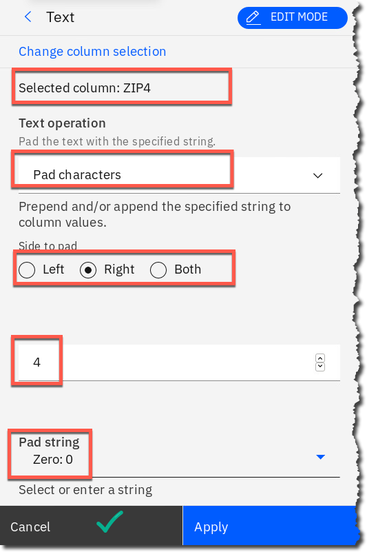

# Organize

## Lab overview

Many organizations find it difficult to understand their own data because it originates from many sources, is dispersed across many silos, and is controlled by different teams.

This Organize lab will show you how to uncover the hidden value in your organization's data and how to build a lineage that is otherwise difficult to establish. Cloud Pak for Data helps your organization move from the manual processes required to establish relationships between data to an automated one aided by the platform's built-in machine learning capabilities.

## Persona represented in this lab

The Data Steward persona is the likely one to perform most of the Organize tasks shown in this lab.

 | **Persona (Role)** | **Capabilities**  |
 | :-: | :-- |
 |  Data Steward | Data Stewards integrate and transform data as well as provide governance, lineage and classification of the data. |

**Note:** this persona often works closely with the Data Engineer because they both work with the data to prepare it for analytics processing by other personas. For example, in this lab one of activities the Data Engineer will do is to create a Transformation job with the Db2 data. In the next lab, the Data Engineer will go on to use that output table to create a final virtualized view of all the data sources joined together.

**Note:** The Data Steward persona also works closely with the Data Quality Analyst persona.

Before we start transforming data, let's first explore the other crucial aspects of the CPD Organize capabilities.

## Logging into the CPD web client (if you have not already done so)

1.  If you are starting this lab stand-alone (without going through previous labs) do the following:
1.  Double-click the desktop icon: Cloud Pak for Data Web Client.
  
1.  The CPD web client GUI displays as shown. Use cpduser and cpdaccess for the *Username* and *Password* and click Sign in.
  

## Reviewing a data asset in the project

Some of the more interesting "Organize" capabilities can be done on a data asset that has been added to a project. In this Trade Co. scenario, the team has created a Project from which they will all collaborate and work from together.

### Data asset overview

1. In the CPD web client, click the Navigation Menu ("hamburger" icon) a Projects.
  
1. Select the project: CPD Workshop Analytics Project. 
1. Under tab Assets a Data assets, click ***CPDUSER.CUSTOMER.DEMOGRAPHICS***. 
1. Close (x) the Information window on the top left. 
1. In the Preview section, general information about the data asset is displayed, as well as column specific information and sample data. 
1. Click on the down arrow for column TAXID to see how Profiling categorized the data. The identifier is: US Social Security Number. 
1. Click Profile to see more details on the profiling information. (It may take a minute or two to render -- be patient.) Notice column GENDER was assigned Identifier Gender, which has 2 of 2 values (M and F) and a displayed frequency for each.  
1. Scroll over to column TAXID and click the twisty to see how this data is profiled. 

### Refine visualizations

1. Click back to Preview then click Refine 
1. Click Visualizations a Map (Hint: you may have to select the double down arrow to see Map.) 
1. Fill in the Details as World, Scatter plot, LONGITUDE, LATITUDE, CITY,ESTINCOME and Income by City 
1. Use your mouse's wheel to Scroll up and center the United States on the visualization. Use the \[Ctrl\] -- and \[Ctrl\] + to zoom in and out to properly size the visualization.
1. Hover over any circle on the map to see the Estimated Income for that City. 
1. If the Data Scientist or Business Analyst wants to keep a visualization, they can download it by clicking on the image icon shown. They can save or review it by downloading it from the ACTIONS section and then using Open with Image Viewer. 
1. Close the Image viewer (if you have it open) and click on the breadcrumb back to the link for the CPD Workshop Analytics project a then Leave Page.  

### Data refinery flows

You should be back at the project CPD Workshop Analytics Project. If you are not there, navigate there as you did at the beginning of this lab.
1. Under Assets, scroll down to find Data Refinery flows
  - Click CPDUSER.CUSTOMER.DEMOGRAPHICS_flow  
1. This Refinery flow was pre-created for you to shorten this lab. It was created in the Refine screen you were in earlier. Click the Steps Box (1).
 - There is only one step in this job, which is a "Text" operation on the ZIP4 column.
 - Hover over the step to see the icons for it.
 - Click the edit (pencil) icon (2) to review the details of the step. 
1. This step refines the ZIP4 column by padding 4 characters of "0" to the Right. This means if the column is already filled in, it will not do anything. If it is empty or filled with 0, it will fill it in with 0000.
  - Click Cancel (the job is OK as it is, but you could have changed it here if you needed to). 
1. Click on the Jobs (arrow by a clock) icon, then Save and create a job. 
1. Give the job a name of Customer Demographics Flow Job then select Create and Run
1. The job takes about a minute to complete. You can see it Running on the screen.
  - Hit the refresh icon to see status more quickly.  
1. Once completed, you can check the logs of the job if you want to. This can be especially useful if the job is complex.
  - Click on it to review the details of the job. 

 | **Persona (Role)** | **Capabilities**  |
 | :-: | :-- |
 |  Data Steward | If the job run fails, simply click the ellipses on that job run and delete it, then run it again. |

1. Click on the breadcrumb trail to return back to the project. 
1. A new Data Asset was created as output from the Flow (refine job).
  - Scroll down to find and then click on Customer Demographics_shaped.csv 
1. Scroll over to find the ZIP4 column.  Notice the data is padded with four zeroes if it was less than four zeroes. If the row already had a four-digit value, it was left alone. 

  | **Persona (Role)** | **Capabilities**  |
  | :-: | :-- |
  |  Data Steward  | The power of Refine can be used by more than just the Data Steward because it is launched from a Project, which enables many more personas the ability to shape and refine data assets to which the Data Steward may have given them access. This gives anyone the ability to explore and shape data on their own with self-service capabilities. If the need is to make a permanent change to the data, for example, to write it back to a database from where it came, that is where Transform comes in. We will explore Transform later in this lab.|

## Reviewing a business glossary

 A business glossary consists of categories and terms.

 Categories provide the logical structure for the glossary so that you can browse and understand the relationships among terms and categories in the glossary. Categories can be organized in a hierarchy based on their meaning and relationships to one another.

 A Business term is a word or phrase that describes a characteristic of the enterprise. Business terms are the fundamental building blocks of the glossary. Each Business term has a parent Category, but it can also be referenced by other Categories. When you create a Business term, you need to provide a meaningful name. Business terms can be assigned to other Business terms, and to other asset types as well.

1. Click Navigation Menu a Organize a Data and AI governance a Categories.  
1. Review a category already created for you: Customer Churn Category. 
1. Review the Business terms and Policy for the Category. 
*Note:**You can view more than 5 items per page. 
1. Click Navigation Menu a Organize a Data and AI governance a Business terms.  
1. Here you can edit or add new Business terms that are either in Published or Draft mode.
 - Click on one to review it in more detail.  

 | **Persona (Role)** | **Capabilities**  |
 | :-: | :-- |
 |  Data Steward | You can create your own Glossary with Categories and Business terms manually, or import them from a file. This workshop was prepared using .csv files in in the following directory on your OS:   In addition, you can import Industry Models from IBM for industries such as finance, banking, healthcare, and insurance and import them into CPD. See the services screen  then Industry Accelerators. |

## Reviewing a Governance Policy and a Rule

An information governance Policy is a natural-language description of a governance subject area. It can contain multiple information governance sub-policies or reference one or more information Governance Rules. It must fulfill a business objective and be relevant and understandable to all users of the policy.

An information Governance Rule is a natural-language description of the criteria that are used to determine whether information assets are compliant with business objectives. Generally, information governance rules are derived from information governance policies and are more specific. The Rules define the actions to take in specific situations to implement the Policy. An information Governance Rule can be referenced by one or more information Governance Policies.

1. Click Navigation Menu a Organize a Data and AI governance a Policies.   **Note:** the first time using the page may take a minute or two to render. **be please patient**.
1. Review the Published Policy that has been associated with our previously reviewed Category. 
1. Scroll down until you find the Rule that is associated with this Policy. Notice you could add another rule to this policy here. (Don't do this now.) Review the Rule by clicking on it.  

 | **Persona (Role)** | **Capabilities**  |
 | :-: | :-- |
 |  Data Steward | A Data Dictionary contains a Business Glossary (Categories and Business terms) as well as information Governance Policies and Rules to ensure data compliance with business objectives. In this lab we have a beginning sample of these items, but in reality, a Data Dictionary for any organization is quite large and can and should be updated as frequently as new data sources, regulations, and other criteria require it. |

## Reviewing Classifications, Data Classes, and Reference Data

### Classifications

A Classification describes the sensitivity level of data. In catalogs, a classification describes the sensitivity of a whole data asset to help catalog members understand the asset. You can use classifications to describe Business Terms, Data Classes, Reference Data Sets, and Governance Rules. In data protection Rules, you can include Classifications in conditions to identify the type of data to restrict.

1. Click Navigation Menu a Organize a Data and AI governance a Classifications.  
1. Scroll to find Classification Confidential and click on it 
1. The Classification is described here. You could also add the primary Category here, but there is no need to do so now. 

### Data classes

Data classes describe the contents of data in a column in a relational or structured data set. Data classes are assigned to columns when profiling a structured data asset and shown on the Profile page in a Catalog or Project.

Watson Knowledge Catalog provides a predefined set of Data Classes. Some Data Classes are categorized into groups, for example:
- If you select **Date**, it also includes **Date of Birth**.
- If you select **Driver's License**, it also includes all driver licenses listed below.
1. Click Navigation Menu a Organize a Data and AI governance a Data classes.  
1. Scroll to find Account Number and click on it. 
1. The Data Class is described here. From here you could edit the description, examples or add the primary Category. 

### Reference Data Set

Reference Data Sets define list of permissible values that are allowed for use within a data field and may be referenced by Business Terms, Policies, Rules and Data Classes in Watson Knowledge Catalog.

You can capture, manage, and socialize reference data --- setting it up once and re-using the reference data in other places.

1. Click Navigation Menu a Organize a Data and AI governance a Reference data. 
1. Scroll to find Reference Data Set State and Province Codes and click on it. 
1. Scroll down to review the Reference Data Set rows (the data). 
1. Click Related content and review how you could relate Data classes and Rules to it. 

## Searching for Data

The Data Scientist and Business Analyst personas may not always know what has been made available to them by the Data Engineers and Data Stewards in CPD. In fact, individual Data Engineers and Data Stewards may not always know what other users of the same persona have made available through their Collect and Organize activities.

This is remedied by the search functionality provided in CPD.

1. Start the search here: Navigation Menu a Home. (Doing this gives your search a neutral context.) 
1. Click in the Search bar. 
1. Type churn and hit Enter. 
1. Notice in the absence of a filter (or context) that multiple kinds of assets related to the term churn are found.
1. Select from Any type -- Data Asset.   **Notice** one Data asset is in a catalog and another is in a project.
1. Click on the Data asset called CPDUSER.CUSTOMER.CHURN which is located in All projects > CPD Workshop Analytics Project. 
1. Here you can review a sample of the data.
 - Next, click Lineage. 
1. The Lineage shown here is relatively simple for this Data asset; however, this could show a more complex lineage should this Data asset have been the result of a Data Flow Design or refine job flow output from a virtualized view of a join of two tables in two different servers. 

   | **Persona (Role)** | **Capabilities**  |
   | :-: | :-- |
   |  Data Steward | The results of this search and exploration of the Data asset tells us that we want to utilize this asset for a Data Flow Design job later in this lab. At this point, we could go to the Overview page of the Catalog View and click Add to Project for easy access later. However, this has already been done, so there is no need to do so now.  |

1. Try the Search again, this time using the word demographics. 
1. Choose the second Data asset named CPDUSER.Customer_Demographics which is under All projects > CPD Workshop Analytics Project. 
1. This takes us to the CPDUSER.Customer_Demographics Data asset we reviewed in an earlier exercise at the beginning of this lab 

   | **Persona (Role)** | **Capabilities**  |
   | :-: | :-- |
   |  Data Steward | You will be using this data in the Data Flow Design exercise to follow. **To recap:** you have searched for, found and selected two tables, from which you will build a job to join and transform this data to create another permanent table. |

## Reviewing the catalog

1. Click Navigation Menu a Organize a All catalogs. 
1. You will see a catalog named CPD Workshop Catalog. Review it by clicking ellipses  a View. **(Tip: You can also click on the catalog name.)** 
1. Review each of the Catalog sections: Browse Assets, Access Control, and Settings. 
1. Return to Browse Assets.
1. Click the. ellipses to the right of the CPDUSER.Customer_Demographics tile.  **(Tip: You can either hover over the name for a flyout that shows the complete name or zoom out.)** 
1. Click the tab Review. 
1.. This is where you can find review ratings and comments for the data, which is another aid in helping you find the best data for your projects. 

## Transforming Data

In this set of exercises, you will use the CPD built-in Data Flow Designer (DFD) to build a job that can transform your data. Note: it is the Data Engineer who would do this.

  | **Persona (Role)** | **Capabilities**  |
  | :-: | :-- |
  |  Data Engineer | Data Engineers build and optimize the systems to allow data scientists and business analysts to perform their work. The Data Engineer ensures that any data is properly received, transformed, stored, and made accessible to other users. |

1. Click Navigation Menu a Organize a Transform data. 
1. Select the project: CPD_Workshop_Transform_Project. 
1. Select the job Transform_Job_Demo_Churn. 

   | **Persona (Role)** | **Capabilities**  |
   | :-: | :-- |
   |  Data Engineer| **Note:** if there is a lock icon next to this job  then click on the lock icon to unlock the job, then you can select it. Just make sure you are not in two different web client sessions at the same time doing this because that might be causing your locked job issue. |

1. Use the zoom icons to get the best view of the entire transform job on your screen. 
1. This job consists of four stages as shown below. Its purpose is to join two tables (represented by the Data assets you previously searched for) CUSTOMER_CHURN and CUSTOMER_DEMOGRAPHICS. It then adds one new column called AGE_GROUP which is derived (transformed) from the column AGE. Finally, it writes out the results to a single table CUSTOMER_DEMOCHURN. 
1. Review the connection of CUSTOMER_CHURN (the top one) by double clicking on it. 
1. The Properties for this connection will appear. Review the connection and other properties.  **(Note: if this does not appear, resize your browser zoom as shown below)** 
1. Review the tab Outputs to see the table columns being passed on to the next stage of the job. Then click OK. 
1. Do the same with the connection for CUSTOMER_DEMOGRAPHICS (the bottom one). 
1. Next, double click on the stage Join. 
1. Notice in this stage's Properties, the two tables are joined by the column: ID. 
1. In this Join stage, select section: Outputs. Notice that the columns now include both tables. 
1. Double click stage Transform. 
1. Select the section Inputs. These are simply the inputs from the Join stage. 
1. Review the section Outputs. Notice each column from Inputs is given a coded "link" prefix before the column name. 
1. Scroll down the list of output columns (using both scroll bars) to find the last output column, which is a derived (transformed) column called AGE_GROUP. Notice it is assigned a SQL type (data type) or VARCHAR, Length 11. Click on this derived column to review its formula. 
1. The Derivation Builder screen shows how it transforms AGE into AGE_GROUP. 
1. Click Cancel and Cancel again to ensure you have not inadvertently changed something. 
1. Double click the last stage, DEMOCHURN 
1. Scroll down in the Properties to find Table name and Table action. This indicates that CPDUSER.CUSTOMER_DEMOCHURN will be replaced with each run of this job. Close without changing anything in this stage by clicking Cancel.  
1. Click on the Save then Compile (wrench) icon. 
  | **Persona (Role)** | **Capabilities**  |
  | :-: | :-- |
  |  Data Engineer | The compile action does the following:  -   *Primary Input* If you have more than one input link to a Transformer stage, the compiler checks that one is defined as the primary input link.  - *Reference Input* If you have reference inputs defined in a Transformer stage, the compiler checks that these are not from sequential files. - *Key Expressions*.*** If you have key fields specified in your column definitions, the compiler checks that there are key expressions joining the data tables. -   *Transforms* If you have specified a transform, the compiler checks that this is a suitable transform for the data type. |
1. The job should complete successfully. 
1. Click the Run icon. When the Job run options box appears, select Run.  
1. Watch the job run...  When it completes, it should look like this: 
  | **Persona (Role)** | **Capabilities**  |
  | :-: | :-- |
  |  Data Engineer  |  You can select the Log to view any warnings or errors during this process. This is helpful when troubleshooting. In this case, you notice a warning that the script attempted to drop a table that didn't exist. No need to worry. |
1. Review the data by opening the Data Server Manager (DSM) for the Db2 Warehouse. Navigation Menu a Collect a My Data a Databases a Db2 Warehouse a ellipsis  a Open database 
1. At the top left of the Db2 DSM console, click on: Summary a Explore a Tables. 
1. Select schema CPDUSER a table CUSTOMER_DEMOCHURN a View Data. 
1. The new column AGE_GROUP contains the derived data, and the output is also the join of the two tables in this schema. 
  | **Persona (Role)** | **Capabilities**  |
  | :-: | :-- |
  |  Data Engineer | If you want to try your hand at building a transformation job from scratch, please see the Organize Deeper Dive lab, section "Transformation Data -- Creating a job." |

## Lab conclusion

We have seen the value in creating a Data Dictionary by creating a glossary of categories and terms, policies and rules, to make data searchable so that data scientist, data engineers and business analysts can "shop for data."

This lab showed you how data can be profiled, visualized, refined, searched and transformed.

The steps covered here could normally take many weeks, months, and sometimes even years, to complete using traditional manual methods. Cloud Pak for Data automates these things so that you can accelerate the time to value of your organization's analytics projects.

**\*\* End of Lab 04 - Organize**
