# Business Use Case: Customer Churn

## Lab overview

Trade Co. is experiencing a decline in review, which appears to be due to losing customers. The current process of predicting customer churn seems to be ineffective as well. The company's executives have asked their senior Business Analyst to help them understand why and to help find a solution.

{width="0.5819728783902012in" height="0.47515529308836396in"}

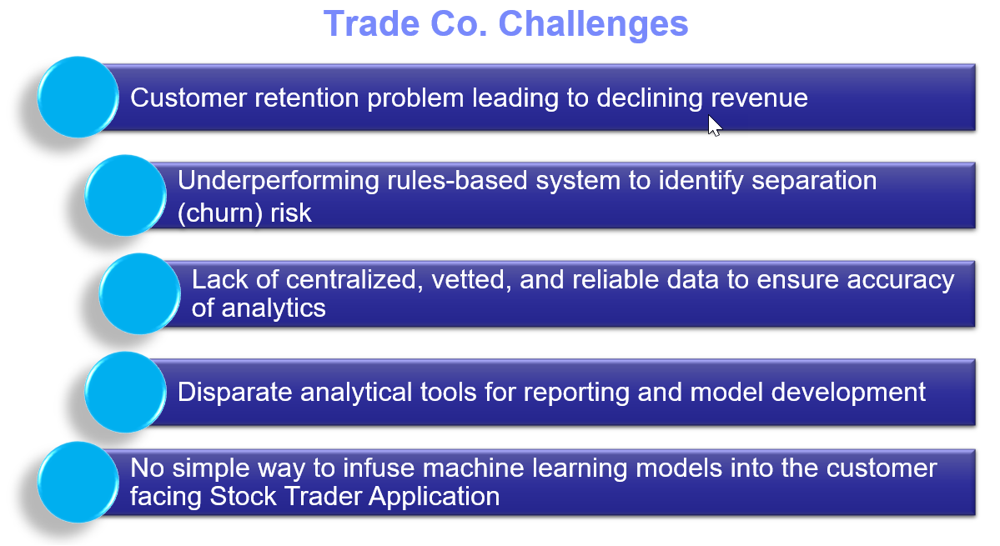{width="6.381944444444445in" height="3.4856003937007873in"}

## Persona represented in this lab

When embarking on machine learning projects, many organizations engage Business Analysts to help gain insight into their data. This persona can use tools like Analytics Dashboards to build visualizations to help the organization more clearly understand their business challenges.

The Business Analyst persona is the likely role to perform the exercises in this lab.

 | **Persona **| **Capabilities** |
 | :---: | :-: |
 |  Business Analyst | Business Analysts deliver value by taking data, using it to answer questions, and communicating the results to help make better business decisions. |

## Logging into the CPD web client (if you have not already done so)

1. If you are starting this lab stand-alone (without going through previous labs) do the following:
1. Double-click the desktop icon: Cloud Pak for Data Web Client. 
1. The CPD web client GUI displays as shown. Use cpduser and cpdaccess for the *Username* and *Password* and click Sign in. 

## Reviewing the dashboard: Monthly Metrics

The Business Analyst has used the Cloud Pak for Data Analytics Dashboarding service to analyze Trade Co. issues. He has come up with a Monthly Metrics dashboard that demonstrates the company's concerns.

This first dashboard was built with the recent trading information delivered to him for the year. It was placed into a CSV file in the project the Business Analyst shares with his team.

1.  In the CPD web client, click the Navigation Menu ("hamburger" icon) Projects. 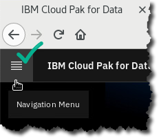
1.  Select the project: CPD Workshop Analytics Project. 
1.  Under tab Assets, scroll down until you find Dashboards.
   - Click Monthly Metrics -- Trade Co. 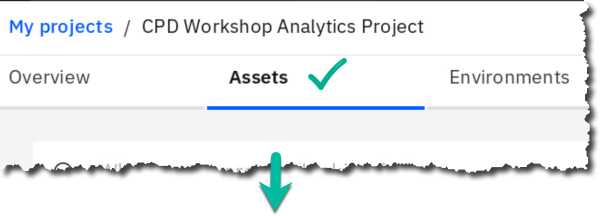 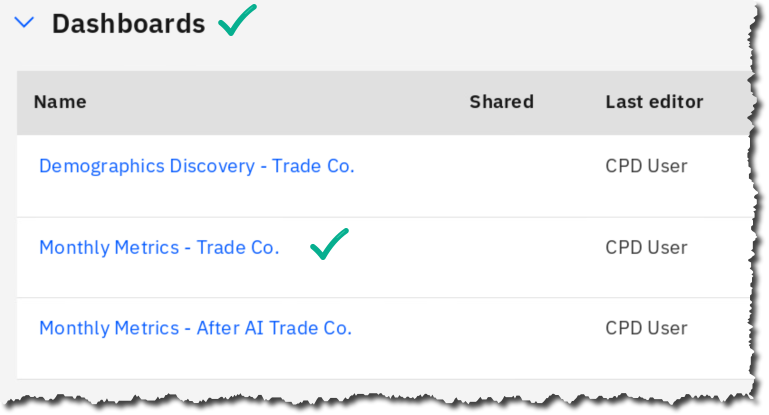
     | **Persona **| **Capabilities** |
     | :---: | :-: |
     |  Business Analyst   | Use \[Ctrl\] -- and \[Ctrl\] + keys to adjust the zoom on the dashboard to best suit your screen. You can also use \[Ctrl\] \[Mouse-Scroll-Button\]|
1. Notice that from January to September, Shares sold per month remains flat while Number of Traders per month are declining.

This verifies that customer churn is in fact occurring, even though the remaining traders are trading more each month, keeping shares sold nearly even.  If Trade Co. could somehow find a way to retain their customers, shares sold per month would go up, thus driving revenue up. 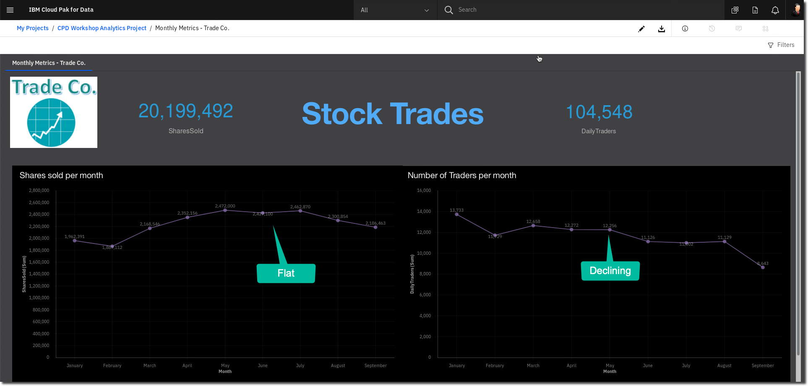
1.  Leave this dashboard by clicking on the breadcrumb trail to navigate to the project again. 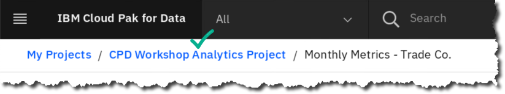 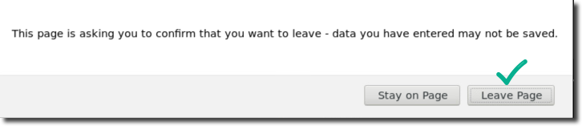
  | **Persona **| **Capabilities** |
  | :---: | :-: |
  |  Business Analyst  | If you would like to see how this dashboard was built, you can build it yourself by doing the following lab: (Deeper Dive) -- Cognos Dashboard Embedded |

## Reviewing the dashboard: Demographics Discovery

The Business Analyst next asked for the company's customer demographics data, joined together with the customer churn data, and joined again with the recent activity data.

This data (representing three different data sets together) was placed in the team project and the Business Analyst created the following dashboard to better understand the situation.

1.  Under tab Assets find Dashboards.
    - Click Demographics Discovery -- Trade Co.  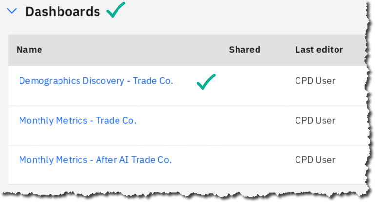
1. Notice there are two tabs in this dashboard; you are currently positioned at tab:
    - Risk Demographics -- Trade Co. 
The top visualizations give Total Units Traded and Dollar Value Traded. You will see later that these are interactive with the rest of the dashboard. 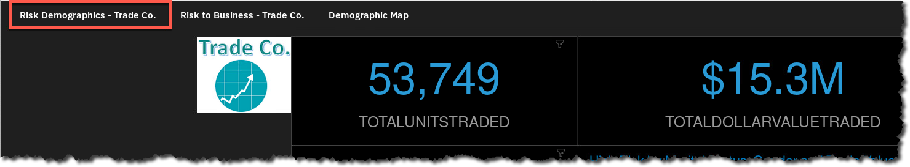
1. Review the top left filter (funnel) icon and notice that a filter has been set to only see information for those considered High in Churn Risk. 
1. Click on the aqua blue portion of the pie chart (which represents Female customers). Notice the top visualizations change in value. For example, the new number displayed in the Total Units Traded visualization would now indicate High Risk Females.
  - Click again on the aqua portion of the pie chart to deselect the values for Female. 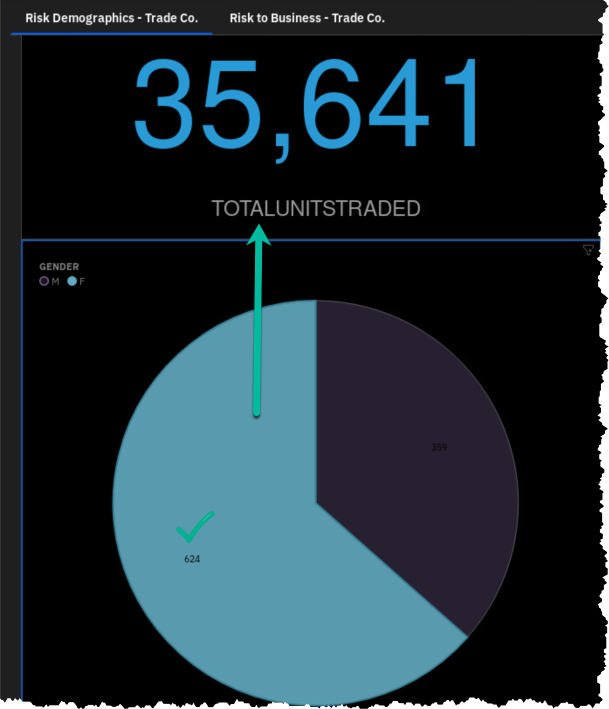 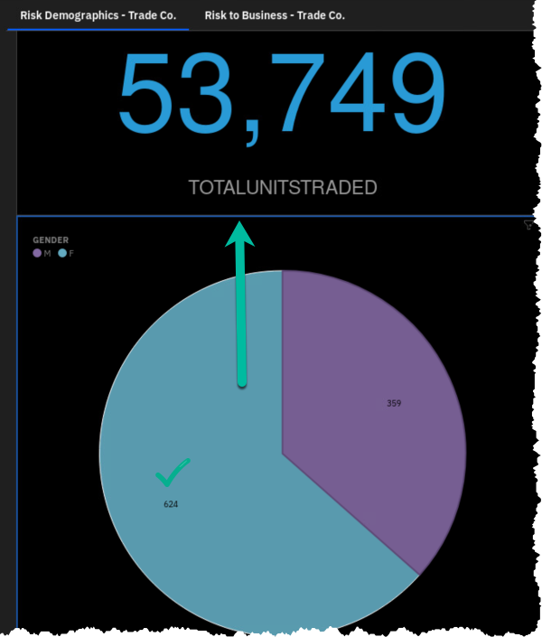
1. The next visualization is also filtered by High Risk, and then sub-divides the data into two charts between Females (on the left) and Males (on the right).  Further, each chart shows bars (Dollars) and lines (Units) for the Marital Status of Divorced(D), Married(M) and Single(S) customers.  This is a complex visualization, but from it you can see that Married Females are the largest group. 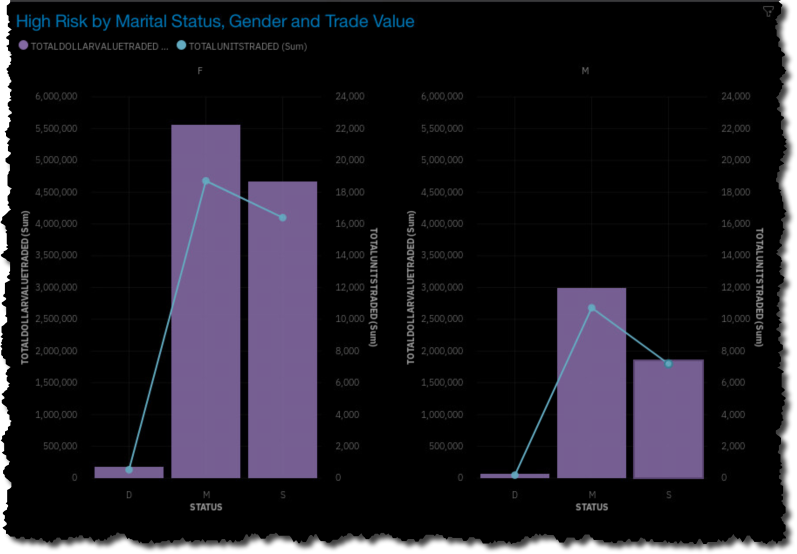
1. In the top filters section, click on the filter for CHURNRISK.
  - Deselect the filter for High and click \[OK\]. 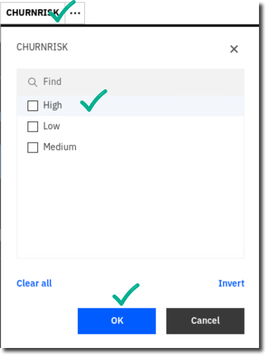
1. With no filters in place for this tab on the dashboard, scroll down to the bottom visualization.
1. The bottom visualization on this dashboard is a Heat Map of many different demographics data points along with ChurnRisk. On this map, the darker the square, the more the risk. 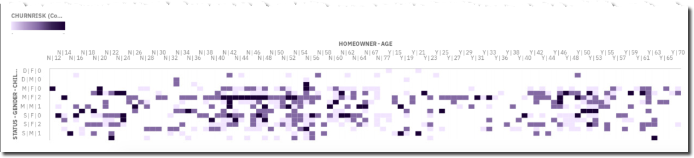
1. Hover over darker purple square on the top left of the Heat Map. Notice it represents Married Females with zero children, who are not homeowners and are 20 years of age. 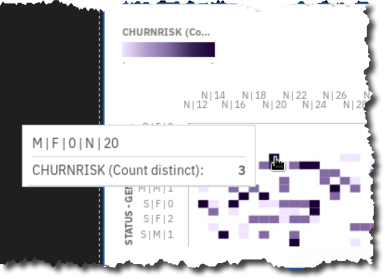
1. Click on the second tab in this dashboard called Risk to Business -- Trade Co.  This analyzes Dollars and Units traded on the top, filtered by the demographics you found in the first tab visualization that appear to be the higher risk. (Note: these filters can be changed at any time in Edit mode to give flexibility to the user.)  This tab also has bottom visualizations that demonstrate that even though this demographic appears to be high risk, they are still fairly active. 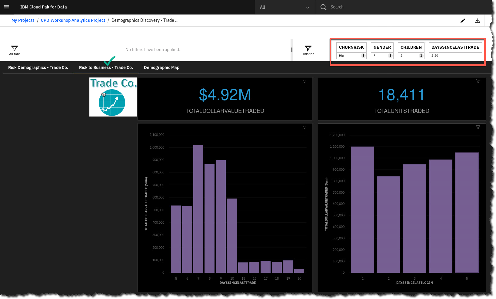
1. Leave this dashboard by clicking on the breadcrumb trail to navigate to the project again. 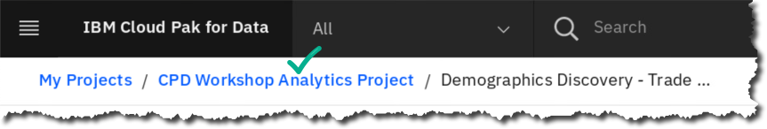 

## Devising a plan

Armed with his findings, the Business Analyst brings this to the Dat 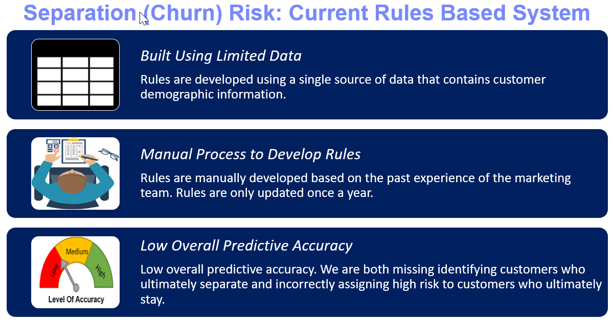
 
The intent is to use a better approach: Leverage Cloud Pak for Data to build a data driven Machine Learning model to infuse into their Stock Trader application. 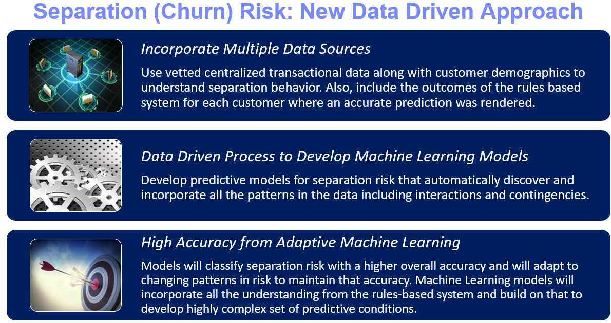
 
With this better model that more accurately predicts churn, the developers will infuse it into their Stock Trader application that will act upon this information in real time. Once a customer (trader) logs into the application, the new ML model will predict the risk of churn for this customer and will then make one of three offers designed to retain them. 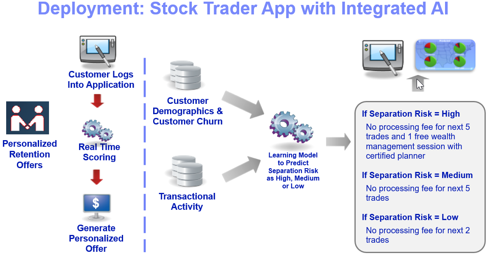

In this case, infusing the new ML model into the Stock Trader application will be as simple as writing one extra microservice that is invoked upon sign in. It will be called the "Predictive Analysis" service (indicated by the green arrow below) and will make the offer after sign in.

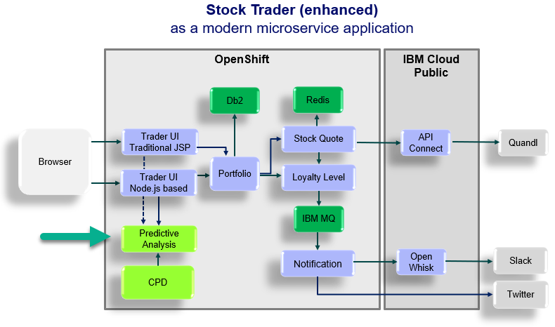

## Reviewing the dashboard: Monthly Metrics After AI

The model was created and infused into the Stock Trader application, which ran for three months. New activity data was captured for this period. The Business Analyst created another dashboard similar to the first that displays the results.

1. Still in the same project, under Assets, scroll down until you find Dashboards.
  - Click Monthly Metrics - After AI Trade Co.   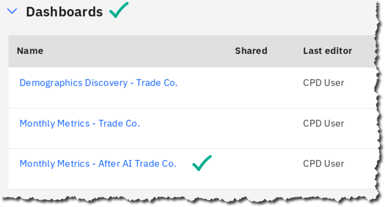
1. This dashboard is similar to the first one in the two visualizations:
    - Shares sold per month and Number of Traders per month  Notice however, new data is present for October, November, and December. 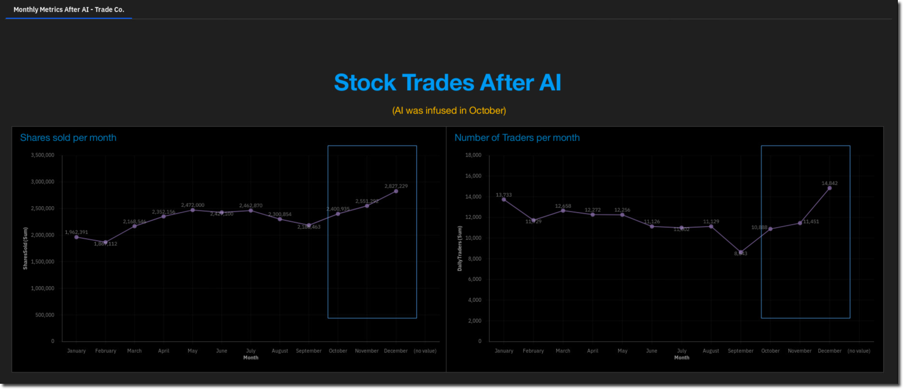

**The data is very encouraging: both data points have gone up!**

Trade Co. is back in business with their successful customer retention offer driven by a smarter application infused with a machine learning model that was built and maintained on Cloud Pak for Data.

## Lab conclusion

This workshop will walk you through how Trade Co. was able to pull off their business success using the Cloud Pak for Data platform.

Each subsequent lab will walk you through one of the steps (Collect, Organize, Analyze, Deploy, Infuse) taken by Trade Co. in their Journey to Cloud and AI using this amazing, industry leading Analytics Modernization platform called Cloud Pak for Data. You will also take on the roles of the various personas involved along the way. The steps in the journey are depicted in the illustration below.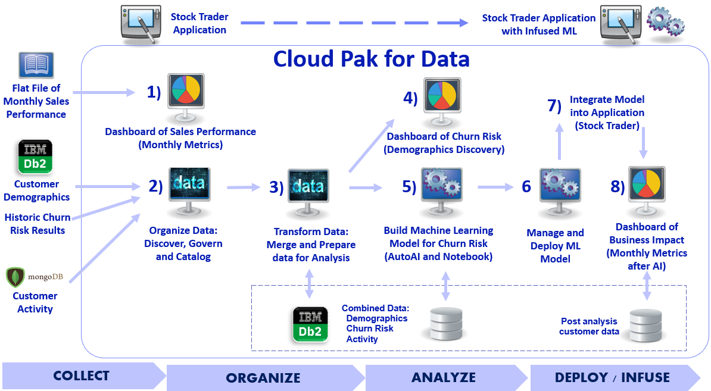

**\*\* End of Lab 02 -- Business Use Case: Customer Churn**

Lab by Burt Vialpando and Kent Rubin, IBM
